# Professional Skills for the Workplace

---

# Course 1: Emotional and Social Intelligence

## Week 1: Emotional and Social Intelligence

### Self-Reflection and Journaling

Self-reflection and journaling are an opportunity to **pause** in order to think about what you have learned or recall events that are relevant to the learning material, to take notice of your thoughts and feelings, and write down what is on your mind. If you have never kept a journal before or done many self-reflection exercises, writing down your thoughts and feelings may seem awkward at first. We encourage you to not let this awkward feeling prevent you from exploring your thoughts and feelings as you progress through this course. Fully utilizing these moments and the tools
provided to you will ensure you have a rich learning experience, and lead to longer retention of the material provided.

### Promoting Emotional Intelligence in the Workplace

The last few decades have changed a lot about doing business. Importantly, there have been many positive developments in how we approach work and team building. One important development is the increased understanding of the impact of emotional intelligence in the workplace.

It’s true that the importance of emotional intelligence for individuals is well understood. But it’s also a critical part of
building a healthy team. Below we explain what emotional intelligence is  and how it can help strengthen your hiring decisions and team dynamics.

#### A Quick Emotional Intelligence Definition

The concept of emotional intelligence, or “emotional quotient” is meant to work alongside IQ — intelligence quotient. IQ doesn’t fully measure a person’s ability or competency. Emotional intelligence, while harder to measure, is a way to complement the picture. A common emotional intelligence definition is “the ability to identify and manage one’s own emotions, as well as the emotions of others.”

Some definitions also include four more precise areas of competencies: self-awareness, self-management, social awareness and relationship management. Of these, self-awareness is considered the core of high EI. If you don’t know yourself and your own motivations, you are poorly equipped to understand others.

One thing that is important to understand is that emotional intelligence in the workplace and elsewhere is not a “soft skill,” and that it is no less important than IQ. It might even be more important. Being able to manage your emotions allows a person to deal with complex and stressful situations more adeptly. High emotional intelligence is a critical trait for leaders and innovators of all types. It helps with everything from building strategies to conflict management.

EQ is a key differentiator in the business world. People with high emotional intelligence make more, perform better and are more likely to close deals.

#### Hiring for Emotional Intelligence

Building a resilient team starts with hiring the right people. We celebrate high performers and brilliant minds, but a team is a team. This means promoting emotional intelligence in the workplace is a must. No one builds a successful
business alone. A team of average performers who work together masterfully is going to outperform a bad team with one star player every time.

Beyond that though, there is evidence that emotional intelligence is a better indicator of individual success as well. Someone with high emotional intelligence is a great hire at every level. It’s hard to measure EQ, so you have to draw it out through personal interaction. Here are some tips on selecting candidates with high emotional intelligence:

Avoid “personality tests.” Personality is not the same as emotional intelligence. Be wary of self-reporting tests as well — if a person isn’t self-aware, how can they report their EQ accurately?

Really talk to the candidate’s references. Make sure to ask specific questions about behaviors that reflect on their emotional intelligence.

Finally, adjust your interview process to emphasize EQ. Speak informally. Ask questions that reveal the candidate’s self-awareness. Put into place hiring practices that give decision-makers time and context to select for this trait.

#### Encouraging Emotional Intelligence on Your Team

Unlike IQ, which is static, EQ is something that can be trained. Like with so many parts of a successful team, it starts with leadership. Make sure that your leadership demonstrates emotional intelligence in your management. Pay attention to your emotions. Encourage self-reflection. Listen actively, and often, and make this a part of your culture.

Additionally, an important part of emotional intelligence in the workplace is responding, rather than just reacting to, difficult situations. Work on managing your unconscious and immediate impulses to frustrating events and people. This takes practice! Learning to deal with difficult moments or difficult colleagues isn’t easy, but model the behavior and encourage it on your team.

It’s also important to celebrate team successes, and not just individual accomplishments. Recognize the parts that everyone played in getting a project to the end point. Having the social awareness to recognize people for their distinct contributions is a key part of emotional intelligence.

#### Emotional Intelligence Skills Are Key to Success

It doesn’t matter what industry you’re in or what your goals are, you need to work with people to get things done. This means that understanding and improving emotional intelligence should be a key part of your strategy. One good thing about EQ is that if you practice it yourself, it will impact your team. This is an area where leadership can make a huge difference. Start with the tips above, but remember that it’s a life-long process.

### 7 Examples of High and Low EQ at Work

We know that high EI/EQ in the workplace is an advantage, but how do we know it when we see it? What does it look like? Here are some good examples of high vs. low EI/EQ at work.

#### An Upset Employee Finds a Compassionate Ear

We all get moody sometimes, even at work. How a person deals with her coworkers or employees when they are having a bad day is a good indication about her EI/EQ level.

If she doesn’t even notice the moodiness, ignores the employee, exacerbates the bad mood, or criticizes the employee and tells them to “snap out of it,” she probably has low EI/EQ. If, on the other hand, she notices that something is up, offers her employee compassion and understanding, and tries to cheer the employee up or distract them from their woes, that’s a great indicator that she has high EI/EQ.

##### People Listen to Each Other in Meetings

Unfortunately, not all meetings are positive and productive; sometimes meetings can devolve into everyone talking at once, no one offering any input at all, or-worst of all-shouting and heated arguments.

If an employee contributes to any of the above in a meeting, he is displaying low emotional intelligence. If he allows others to have their say, listens attentively and refrains from interrupting others, and gently but effectively keeps everyone on task, he is probably high in EI/EQ.

#### People Express Themselves Openly

A person who is comfortable speaking up about things that are important, and is just as comfortable listening to others talk about their own opinions, is showing high workplace EI/EQ. She is probably also adept at expressing her own emotions in an appropriate way and accepting of others who express their own emotions.

A person who keeps things bottled up or gets upset when others disagree with her at work is likely low in emotional intelligence. She might spar with her coworkers about their opinions, or conversely, expect everyone to simply keep all emotions and opinions to themselves.

#### Most Change Initiatives Work

If a workplace is generally high in emotional intelligence, it likely handles change well. Change initiatives are probably taken seriously and carried out in earnest.

On the flip side, workplaces with low emotional intelligence are resistant to change, fail to put in the effort necessary to make change initiatives succeed, or even actively sabotage them. Additionally, poorly through-out initiatives indicate that the management team is low in EI/EQ and does not understand how their proposed changes will affect their employees.

#### Flexibility

A workplace that offers flexibility and understanding of the complex, busy lives of organization members is one that is probably high in EI/EQ. Managers and executives who accept that people have differing needs and offer ways to work smarter are displaying a good sense of emotional intelligence.

Managers and executives who refuse to allow their employees flexibility and hold strictly to the way things have always been done (when there is no need to do so) are showing signs of low emotional intelligence.

#### People Have the Freedom to Be Creative

Similarly, workplaces that allow their employees the opportunity to be creative and innovative are high in EI/EQ. Giving people the chance to practice their creativity and think outside the box is not only a welcome gesture for employees, it is also a smart move for the workplace.

Workplaces that make their employees stick to strict policies and procedures (again, when there is no need for such strictness) are low in EI/EQ. Not understanding the value of creativity and our employee’s need to be imaginative and invested in their work is a hallmark of low EI/EQ.

#### People Meet Out of Work Time

Finally, a good sign of emotional intelligence in the workplace is when organization members meet outside of the workplace. Organizations where employees enjoy happy hours, having lunch together, or other social activities indicates that there is a high level of EI/EQ present.

Workplaces that don’t feature such strong bonds and those in which employees do not spend any non-working time together are likely low in EI/EQ. When people are emotionally intelligent, they tend to get along and see the value in investing their time and energy into workplace relationships, but people low in EI/EQ are generally not interested in building quality relationships with their peers (Dhanak, n.d.).

#### Summary

##### Leaders and employees that demonstrate high EQ:

* Navigate not just motivating and empowering employees and team members, but also navigating complex and challenging decision making with the mastery of emotional response.
* Are realistic but not negative and overcome with their emotions
* Are enthusiastic and confident in themselves and the team
* Demonstrate trust and respect
* Are Communicative and Cooperative
* Volunteer for assignments and decisions
* Include and engage others as much as possible
* Share openly with the team
* Demonstrate empathy
* Actively Listen
* Are flexible
* Develop their teams

##### Low EQ may show up as:

* Emotional outbursts, typically out of proportion to the situation at hand
* Not listening to others
* Becoming argumentative
* Blaming others
* Believing that others are overly sensitive because the person with low EQ cannot understand how others feel
* Difficulty maintaining friendships and other relationships with others
* Stonewalling, or refusing to see other's points of view

## Week 1: Self-Awareness

### List of Emotions

#### Positive
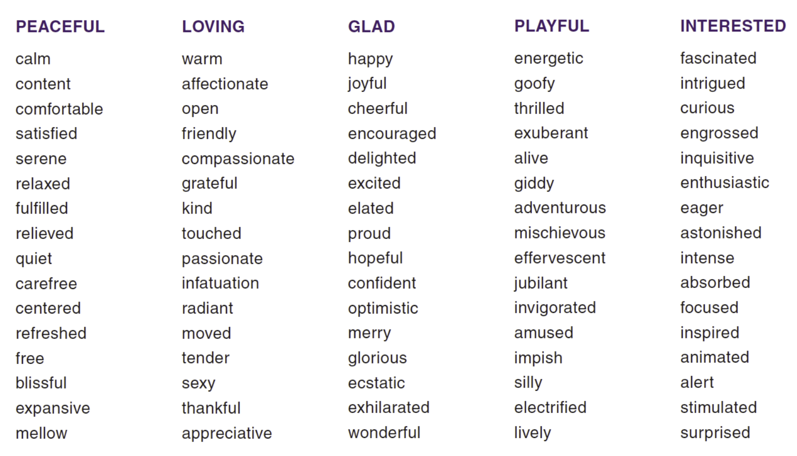

#### Negative
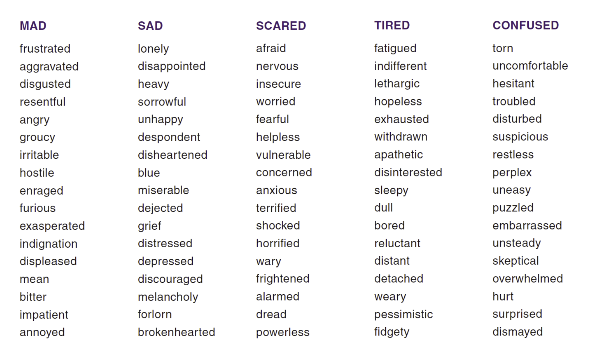

### Articulate Your Feelings

It’s not enough to know your emotions. People with high ESI have the ability to describe them to others. This communication is key when working with others that are still learning their emotional triggers and how to handle them.

Consider the following situations and describe how you would feel in each situation:

* You read an email that implies you dropped the ball.
* Your partner blames you for something you feel is unfair.
* Another driver cuts you off on the highway.
* A close friend or associate begins to cry unexpectedly.

By first identifying your own emotions and reactions, you become more mindful and start the process of building control.

Note how you typically respond to these situations by answering the following reflection questions. Be honest about your reactions.

1. What are the benefits of your response?
2. What are the consequences of your response?
3. What would be the benefits if you changed your response?
4. What will you do with this knowledge?

### The Ripple Effect of Emotions

We just learned and experienced that our emotions can have a ripple effect on others. Let's examine how many people you could be impacting.

* List the people you encounter each day: face-to-face, phone, email; look above and below yourself in the organization hierarchy.
* How many people do you touch over a week's time?
* How many people look to you for leadership, support, collaboration?
* How many people might be (directly or indirectly) impacted by your emotions or behaviors?
*  What different choices will you make with this information?

### Get Some Feedback

* Listen carefully and try not to get defensive
* Check your perceptions and paraphrase
* Ask questions for clarification; ask for examples, paraphrase again
* Evaluate the accuracy and potential value of what you heard
* Gather additional information from additional sources and/or observe your own behavior
* Do not overreact but do modify behavior when appropriate
* Say “Thank you for the feedback”. Learn to appreciate the learning you receive from feedback

### What Did You Take Away From Self-Awareness?

Take a moment to reflect and answer the following questions:

* What did you take away from the self-reflection exercises?
* What did you learn about the ripple effect of your emotions and behaviors?
* What did you learn about yourself when you asked others for their perspective?
* Remember your best day and a not so good day – what was the difference?

## Week 2: Self-Management and Self-Regulation

### Cognitive Distortion

* All or nothing or polarized thinking: You look at things in absolute, black and white categories.
* Overgeneralization: You view a negative event as a never-ending pattern of defeat.
* Mental Filter: You dwell on the negatives and ignore the positives.
* Discounting the positives: You insist that your accomplishments or positive qualities “don’t count”.
* Jumping to conclusions: (a) mind reading – you assume people are reacting negatively to you when there’s no definite evidence; (b) fortune telling – you arbitrarily predict things will turn out badly.
* Magnification or Minimization: You blow things way out of proportion or you shrink their importance inappropriately.
* Emotional Reasoning: You reason for how you feel; “I feel like an idiot so I really must be one.” Or “I feel like doing this, so I’ll put it first.”
* Should Statements: You criticize yourself or other people with “should's” or “shouldnt's.” “Musts”, “Oughts”, “have to's” are similar offenders.
* Labeling: YOU identify with your shortcomings. Instead of saying, “I made a mistake,” you tell yourself, “I am a jerk” or “a fool”.
* Personalization and Blame: You blame yourself for something you weren’t entirely responsible for, or you blame others and overlook ways that your own attitudes and behavior might contribute to a problem.

#### Answer the following questions:

* Which of these cognitive distortions resonated with you?
* How could you manage them when they come up?
* How will you change your self-talk?

### Practicing the Pause

"The pause" may be as simple as taking a moment to stop and think before we act or speak. If everyone made that a practice, imagine how much shorter emails could be, how much time would be saved in meetings, and how many incendiary comments on social media would be eliminated.

But remember: The pause is easy in theory, difficult to practice.

Even if we're generally good at managing our emotions, factors like added stress or a bad day can inhibit our ability to do so at any given time. And we're not just talking about upsetting situations; we are often tempted to jump on opportunities that look really good at the time but that we haven't really thought through. When you work on pausing before speaking or acting, you create a habit of thinking first.

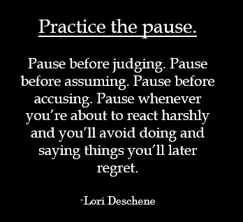

* When was a time that you probably should have practiced the pause and didn't? How might that have changed the situation?
* What strategies can you incorporate to help you practice the pause more often?

### Journaling

#### What is journaling?

Simply put, journaling is “writing life down.” Two key reasons to keep a journal:

#### Recapturing the moment

Spending just a few minutes a day writing in a journal is an opportunity to slowdown, revisit key events of the day, and
describe what happened and what you recall thinking or feeling. Writing to reflect on how you reacted and felt throughout the day can provide useful insight into how you see yourself and the world around you. This knowledge can help you gauge the progress you’re making with your treatment plan.

#### Learning from the moment

Journaling is a great self-teaching tool. It provides a safe environment for examining how changing your thoughts or behaviors might bring about a different outcome. Many people find that once they’ve recounted the day’s events, they can also spend a few minutes journaling about the lessons of the day, and “practicing” alternative ways to react to stress, handle relationships, and recognize and appreciate life’s positive moments.

#### How can journaling help me take care of myself?
If you are looking to become more aware of your thoughts and more skilled at turning them around when you become
counterproductive or destructive, a written journal provides a place to “catch” those thoughts and experiment with how a different way of thinking might impact a given situation. You may find it helpful to share insights you have gained through journaling with your healthcare provide

#### Tips for starting a journal
* Commit time to write in your journal on a regular basis – ideally, daily.
* Find a quiet time and place to journal

#### What should I write?
Every person’s journal is different. Here are a few of the things people keep track of in their journals:

* Concerns
* Accomplishments
* Disappointments
* Accounts of interactions with others, both positive and negative

#### What strategies will you use to help yourself commit to journaling more?

### Managing Stress

#### Self-Regulation and Stress

Managing stress should be approached from two different, complementary and interrelated angles:

1. First, stressors -- events or situations that result in the feeling of being overwhelmed or threatened -- should be identified and then assessed to ensure that individuals and groups are differentiating between less controllable sources of stress and those that are more controllable, either through changing the events or situations themselves
or changing one’s response to them.

2. Second, for the less controllable sources of stress there are a broad range of constructive strategies for minimizing the toll they might otherwise take on our physical and emotional well-being.

List the both the controllable and less controllable stressors in your life.

For the less controllable stressors, identify which of the following constructive strategies are you using to manage your
stressors? You are also invited to include your own constructive strategies.

* Meditation, massage, visualization and other techniques that evoke a “relaxation response”- shifting one’s “fight or flight” orientation to a more subdued and introspective one.
* Walking, jogging, yoga, dancing and other “flow oriented” exercise programs.
* Good nutrition. Pay attention to the foods you eat and how they make you feel emotionally and physically.
* Ergonomics- the alignment of a person’s body with their physical workspace.
* Mentorship and coaching that is often included in workplace programs.
* Enjoying music, nature and the arts.
* Charitable activities and volunteer work.
* Teaming up with one’s peers to help with stressful situations.
* Positive recognition of performance milestones and celebration of customs.
* Using humor to balance feelings of anxiety or to laugh at one’s self.

#### Default strategies you that may not serve you and you should watch out for are:

* Substance abuse, overeating, gambling, smoking, and other addictive behaviors.
* Procrastination, excessive time off, and other forms of avoiding responsibility.
* A victim mentality or, conversely, seeking excessive control of the environment.

#### Practicing Self-Management – The five key points to help you master Self-Management:

1. Be consistent. Part of managing oneself is the ability to be stable. The values you hold dear should always be transparent. Always changing can not only cause others to question your beliefs, but it can also cause you to become confused about what you truly believe.
2. Stick to the plan. If you are scheduled to complete a particular task, do it. Don’t just do it, but make sure it is done
in a timely manner. It is easy to feel out of control when you disregard the plan you are to follow.
3. Be accountable. There are times when things don’t work out as you plan, but you have to be able to admit that and then use your flexibility to get things back on track. The ideal result is that you easily bounce back and complete the task, but even during those times when this is not the case, you are expected to adjust.
4. Educate yourself. We live in an ever-changing world and you want to be able to keep up with it.  Don’t let change pass you by, embrace it. Be an avid reader. Talk and listen to mentors and peers. They may know something that could help you along your journey.
5. Stay physically fit. Many people don’t think of staying fit when they talk about self-management, but it is a very important part of being able to practice the four preceding points. Exercising your body is just as crucial to self-management as exercising your mind. A body that is not well rested, nutritionally fed, or physically exercised can lead to emotional and physical illnesses.

## Week 3: Empathy

### What is Empathy?

Empathy is the ability to recognize emotions in others and to understand other people's perspectives on a situation.  Empathy is described as sensing what people are feeling, being able to take their perspective and cultivating report and attunement with a broad diversity of people.

#### What are the Competencies of Empathy?

1. understanding others
2. developing others
3. having a service orientation
4. leveraging diversity
5. political awareness

#### Empathy is a Powerful Interpersonal Skill

Empathy is one of our greatest interpersonal skills because it allows us to have better communication with people around us and increase our understanding of others. Empathy can simply mean to put ourselves in the other person's shoes. But it can also mean to take an active role in getting to know the people around you and treating them with respect they deserve.  Empathy enables you to use insight to improve someone else's mood and to support them through challenging situations.

#### Empathy VS Sympathy

Empathy is often confused with sympathy, but they are not the same thing. Sympathy is a feeling of concern for someone and a sense that they could be happier. Unlike empathy, sympathy doesn't involve shared perspective or emotions. You can feel sympathy for someone you see in tears on the street, for example, without knowing anything about their situation. Sympathy may develop into empathy, but it doesn't necessarily do so.

#### Effective Empathy

* [Understanding Empathy](https://www.youtube.com/watch?v=vAJ6jDoePyY)
* [Brene Brown on Empathy](https://www.youtube.com/watch?v=1Evwgu369Jw)

To use empathy effectively, you need to put aside your own viewpoint and see things from the other person's perspective. Then you can recognize behavior that appears at first sight to be overemotional, stubborn, or unreasonable, as simply a reaction based on a person's prior knowledge and experiences.

### The Stages of Empathy

1. **Cognitive:** the most rational, intellectual and emotionally neutral ability
2. **Emotional:** the ability to share the feelings of another person and so to understand that person on a deeper level
3. **Compassionate:** the most active form of empathy

#### Cognitive Empathy

Cognitive empathy is the ability to understand what another person might be thinking or feeling. It need not involve any emotional engagement by the observer. Managers may find cognitive empathy useful and understanding how their team members are feeling. And therefore, what style of leadership would get the best from them today.  Similarly, sales executives can use it to gauge the mood of the customer. Helping them to choose the most effective tone for a conversation.

#### Emotional Empathy

Sometimes called effective empathy, because it affects you or changes you. It's not just a matter of knowing how someone feels, but of creating genuine rapport with them. For some of us, this kind of empathy can feel overwhelming.  People with strong empathic tendencies can become immersed in other people's problems or pain. Sometimes damaging their own emotional well being. This is particularly true if they don't feel able to resolve the situation. You can avoid this kind of emotional generosity burnout by taking breaks, checking your boundaries and strengthening your ability to cope in such a demanding role.  It helps to build trust between managers and team members and develop honesty and openness. But empathy is most valuable when it's combined with action.

#### Compassionate Empathy

Compassionate empathy is the most active form of empathy. It involves not only having concern for another person and sharing their emotional pain, but also taking practical steps to reduce it. For example, imagine that one of your team members is upset or angry because he or she delivered an important presentation badly. Acknowledging their hurt is valuable and affirming their reaction by showing signs of those feelings yourself is even more valuable. But best of all is putting aside some time for them and offering practical support or guidance on getting through the situation and preparing for next time.

### Techniques for Building Empathy

Empathy is one of the five key components of ESI, emotional and social intelligence, and it helps to build trust and strengthen relationships. To use empathy effectively, give people your full attention, looking out for verbal and nonverbal clues to help you fully understand their situation. Set aside your own assumptions, acknowledge people's feelings, allow an emotional connection, and then take positive action that will improve your and their well being.

**1. Challenge yourself:**
* Undertake challenging experiences that push you outside your comfort zone
* Doing things like this will humble you, and humility is a key enabler of empathy

**2. Get out of your usual environment:**
* Travel, especially to new places and cultures. It gives you a better appreciation for others

**3. Get feedback:**
* Ask for feedback about your relationship skills from family, friends, and colleagues, and then check in with them periodically to see how you're doing.

**4. Explore the heart:**
* Read literature that explores personal relationships and emotions. This has been shown to improve the empathy of young doctors, for example.

**5. Walk in other people's shoes:**
* Talk to others about what it's like to walk in their shoes about their issues and concerns, and how they've perceived experiences you've both shared. You can explore a powerful approach to seeing others points of view with this exercise.

**6. Examine your biases:**
* We all have hidden and sometimes not so hidden biases that interfere with our ability to listen and empathize. These are often centered around visible factors such as age, race, and gender. Don't think you have any biases? Think again, we all do.

**7. Cultivate your sense of curiosity:**
* What can you learn from a very young colleague who's inexperienced? What can you learn from a client who's older and more experienced? Curious people ask a lot of questions leading them to develop a stronger understanding of the people around them.

**8. Listen more:**
* Listen more carefully to what someone's trying to tell you. Use your ears, eyes, and gut instincts to understand the entire message that they're communicating. Start with listening for keywords and phrases that they use, particularly if they use them repeatedly. Then think about how as well as what they're saying. What's their tone or body language telling you?

**9. Ask better questions:**
* Bring three or four thoughtful even provocative questions to every conversation you have with clients, or colleagues, or family members. Prepare for the conversation to change direction as the other person's thoughts and feelings also change.

**10. Take action:**
* There's no one right way to demonstrate your compassion and empathy. It will depend on the situation, the individual, and their dominant emotion at the time. Remember, empathy is not about what you want, but what the other person wants and needs. Any action you take must benefit them. Remember, that empathy is not just for crisis. Seeing the world from a variety of perspectives is a great talent, and it's one of those that you can use all of the time in any situation. This adds to your adaptability and resilience.

**11. Random acts of kindness:**
* Brighten anyone's day and make us feel more empathetic. Practice these skills often. When you take an interest in what others think, feel, and experience, you'll develop a reputation for being caring, trustworthy, and approachable, and you'll be a great asset to your team and your organization.

#### Shifting Perceptual Positions - Walking in Another's Shoes

It has been said that one of the best ways to understand another person’s point of view is to walk a mile in his or her shoes. Using perceptual positions, a person can mentally review (or preview) a situation from a number of different standpoints in order to enrich their appreciation of what is involved.

* **Shifting perceptual positions can help you gain a new perspective on a problem or challenge or learn from an experience.**

The idea of multiple perceptual positions in NLP was inspired by Gregory Bateson, modelled from Virginia Satir and developed in use by John Grinder. By adopting different perceptual positions people can develop new choices for responding to events.

For example: A school day when it starts to snow heavily looks very different from the viewpoint of a pupil, parent, teacher and bus driver. Knowing what to do is almost inevitably harder if the Principal does not consider the views of
everyone involved.

This picture describes the 3 positions you can take:

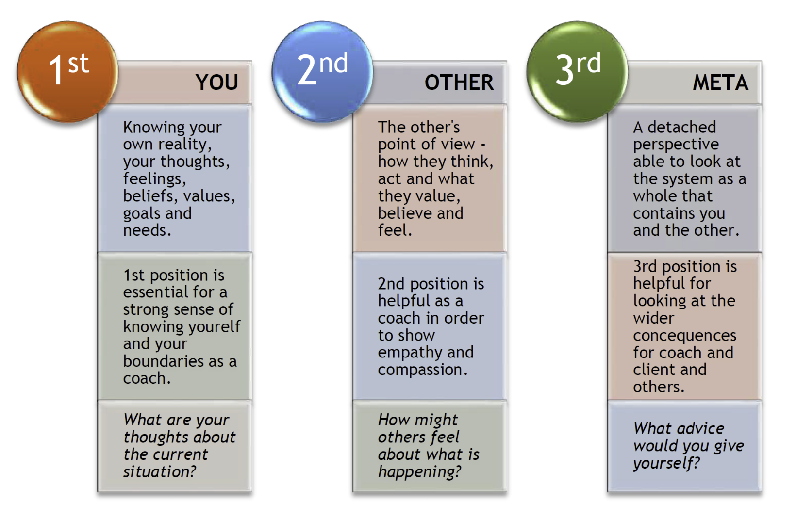

We would like you to use these position descriptions to help you evaluate an event or relationship in your own life. You may use the example of the school day where it is snowing if you can't think of an example from your life.

**See the situation from the first position - You**

See the situation through your own eyes. Be aware of your own thoughts and feelings and how they are impacting on the relationship or event. What are your own needs? What do you want to have happen?

**See the situation from the second position - Other**

Imagine what it is like to be the other in the situation. Put yourself in their shoes - as if you are looking back at yourself, seeing, hearing, and feeling as the other person would, given their own map of the world. What are their needs? What do they want to have happen? What intention lies behind their words and actions?

**See the situation from the third position - Meta**

Take a detached viewpoint and look at the system as a whole. Imagine looking at yourself and the other person 'over there' seeing the two of them interacting. Pay particular attention to actual behavior, body language and the sound of
their voices. What helpful wisdom or advice would you (or someone else) give the you ‘over there’?

**Now go back to the first position – You**
* What is different, what has changed?
* What new options and choices do you now have?
* How will your insights affect the situation or relationship in the future?

#### More on Listening

> People start to heal the moment they feel heard.
>
-[Cheryl Richardson](https://cherylrichardson.com/)

> Listening is the art that requires attention over talent, spirit over ego, and others over self.
>
-Dean Jackson

There are so many great quotes about listening, probably because it is the skill we all want to see more from people. If you truly want to build your empathy, you must learn to listen.

##### Why is listening so hard?

* We listen at 125 – 250 words per minute, but we think at 1000 – 3000 words per minute.
* According to a study in the year 2000, humans had an attention span of 12 seconds—only 33% longer than a goldfish at 9 seconds. Recently, Microsoft discovered that the average person's attention span is now less than a goldfish at a mere 8 seconds.
* Most of us are distracted, preoccupied, or forgetful about 75% of the time we should be listening.
* Immediately after listening, we recall about 50% of what we hear.
* Long term, we remember only 20% of what we hear.

##### The Five Blind Spots
**1. Assuming everyone thinks like me.**
* Too attached to your own point of view, addicted to being right.

**2. Feelings change our reality.**
* (Dis)Trust changes how we see reality.

**3. I am too fearful to empathize.**
* When we are upset we are unable to connect.

**4. I remember, therefore I know.**
* We actually remember what we thought about what the person was saying, not what they said.
* We drop out of conversation every 12-18 seconds to process what people say.

**5. I am listening so I actually know what you really mean.**
* Meaning resides in the listener, not the speaker.
* We pull meaning from our past experiences to help us interpret what we hear.

##### Keys to Effective Listening

> "We listen in order to learn and retain information. If we are speaking, we are not listening or learning anything to add to our sum of knowledge. This is why the first step to effective listening is to stop talking!"
>
-Ken Fracaro

1. Listen to understand - NOT to respond.
2. Embrace silence.
3. Don't interrupt unless given permission. Ask permission at the beginning of the conversation to interrupt in order to ensure the conversation stays on track.

##### Listening Power Tools
**Paraphrasing** - Paraphrasing shows the other person that you have listened and understand what has been said. To paraphrase, sum up and restate the original information. Your restatement should be shorter than their statements.

Practice by paraphrasing this statement:

"My supervisor really likes my work, and I like the people there. However, I feel like something is missing. I want to have more responsibility, more challenge."

**Reflecting** - Reflecting, or sharing your observations with the other person, can be a powerful tool in your communication. You may hear something that can create new awareness or shift their perspective.

Here are some examples:
* Emotion in their voice
* Expression of what they truly value
* Messages that are inconsistent with their stated goals, values, or priorities
* Gaps in priorities
* Assumptions
* Progress
* Gaps in critical thinking
* Gaps in skills, abilities or training

### Ask Better Questions

Here are a list of examples to help you learn to ask better questions.

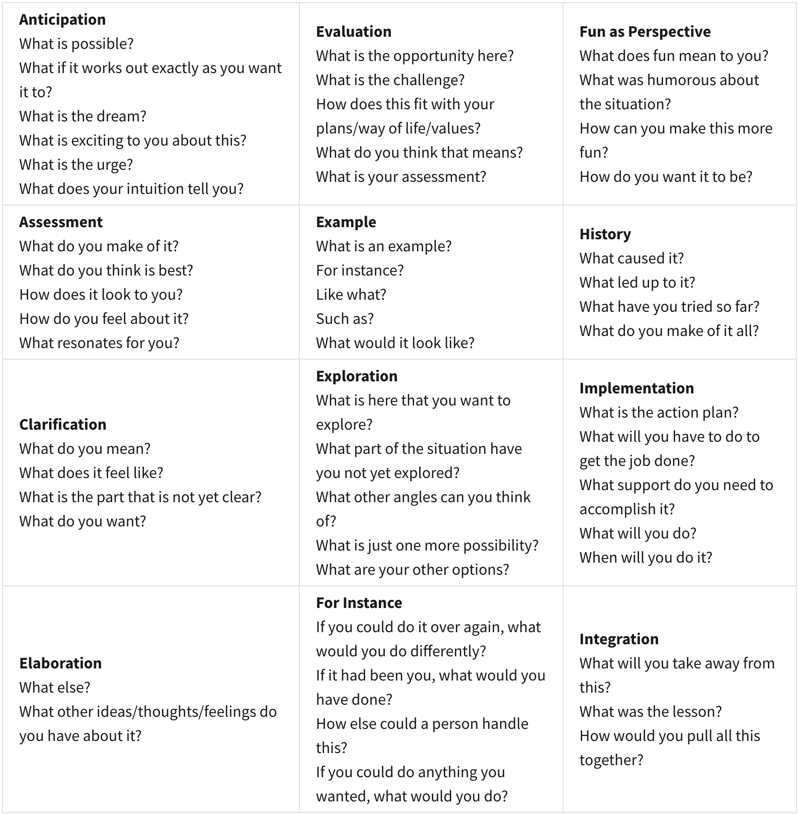

### Empathy in Practice

**How can you practice and build empathy?**

* Look for the good and similar
* Assume positive intent, assume that people have the best of intentions
* Practice a “walk in their shoes”
* Listen better
* Try to identify with what the other person is saying and feeling (perhaps by reflecting on an experience you’ve had that produced a similar emotion in you)
* Look at situation from other person’s point of view
* Ask, a question is always the answer, if you are in doubt about what the other person may need Ask.  If you are curious about what the other person would do or has done in a particular situation, ASK.  Be open and curious and create a to a dialog for understanding.

## Week 4: Relationship Management

### The Social Brain and Its Superpowers
* [TED Talk by Matthew Lieberman, PhD](https://www.youtube.com/watch?v=NNhk3owF7RQ)

### Strategies for Building Social Skills

We hope these 10 strategies help you in your efforts to build and maintain relationships.

#### Strategy #1: Observe the ripple effect from your emotions:

Your outpourings of emotion are like stones dropped into a pool of water that send
ripples throughout the people in your life. Since emotions are the primary drivers of your behavior, you need to understand the effect they have on other people.

Your emotions are powerful weapons and continuing to think that their effects are instant and minimal will only do you a disservice. The key to observing the ripple effects
of your emotions is to watch closely how they impact other people immediately and then use that information as a guide for how your emotions are bound to affect a wider circle long after you unleash the emotions. The more you understand how your emotions ripple outward, the better equipped you’ll be to choose the type of ripples that you want to create.

Remember in Module 1 we asked you to examine the number of people whom your emotions may be impacting. Now think back to a recent emotionally charged event.

* What Impact did your emotions leave on others?
* Could it have changed their perception of you?
* What didn’t you realize at the time of the event?
* What could you have done differently?

#### Strategy #2: Manage Perception

Perception can be a hard aspect to learn from since most of the time our perception can only be drawn from our own experiences – and we’re pretty biased when it come to our own thoughts. Perception is an important tool in controlling behavior because it helps us determine how we can appear to others and how other people’s behaviors can influence us. Your belief in yourself can affect your perception and can in turn affect your outward behavior.

Review the Ladder of Inference from Week 3- How will you manage your own perceptions?

Manage the perceptions of others:

We may not always know exactly how people perceive us since many will not say these things out loud, but we can make our own conclusions based on our perception of their behavior.

Reflect on your recent interactions at work and answer the following questions:

* Do co-workers come close when they speak to you or do they try to move away?
* Do they smile and interact with you or do they seem withdrawn?
* How do your perceptions and thoughts impact people and their behaviors?
* How likely is it you form some of the same conclusions and determine how to respond to the behaviors they are displaying.

#### Strategy #3: Know Yourself and Your Triggers

Feedback from ourselves can be just as valuable as feedback from others.  As long as we are being honest with ourselves and not self-deceptive. Reflection gives us a chance to learn from our past experiences (even our mistakes) and recognize the chance for learning opportunities. By reflecting on our actions, we can see firsthand what actions
we took, how they played out, and what kind of effect they had on people.

Reflect on an interaction at work that that triggered a negative emotional response from you.  Use all of your senses to recreate the experience in your mind and reflect on:

* The actions that you took.
* What behaviors showed up?
* What did you feel at the time?
* What type of reactions did you receive from other people?

What could you do differently next time?

#### Strategy #4:  Be open to change

Humans are designed to be creatures of habit. We often have the mindset of “we want what we want when we want it”, and if something throws a kink in our routine, we can get frustrated and upset. Being open to change allows us to adapt to new surroundings and situations and helps us grow as a person. Changing our attitude about ourselves and others can help determine how we build our connections. Sometimes after we receive feedback from our peers, we may need to change how we do things or behave in a group. Perhaps after a meeting we decide we need to change how we plan our presentations. Whatever the reason, it is important to not disregard the importance of your willingness to change and not turn a blind eye to its prospects. Changing how we see ourselves and the people that surround us can have a positive impact on our attitudes and can help build better relationships with our peers.

Tips for accepting change:

* Determine how the change can benefit you
* Don’t assume a need for change is negative
* Recognize that change is a chance for improvement

#### Strategy # 5: Separate Facts from Emotions

The main difference between facts and emotions is that facts are based on definite results while emotions are often involuntary and one-sided. But both facts and emotions can affect our behaviors and change how we act towards others. Facts can drive a conversation and allow people to connect on a logical level. Emotions are involved in everything we do, but sometimes they can affect the impact of our behavior and the information we are talking about.

Any social situation is most likely driven with emotions, and sometimes this can cause facts to become irrelevant and even misconstrue the information given. For example, a male speaker may not be taken seriously at a feminism rally, or a group full of teachers may not listen to a group of school board members. When you recognize that emotion may be driving the situation, it’s time to reflect back on the situation and rediscover the facts and figures of the information. You may have to be a leader in the group and remind everyone to focus on the facts and save the emotions for later.

#### Strategy #6: Build Rapport

Rapport occurs when two or more people feel they are in sync or on the same wavelength. Rapport is the basis for building relationships and being able to influence others.

When building rapport get into rhythm with the other person on as many levels as possible. Body Language Mirroring: Follow along with their body language and gestures. If they sit back, you sit back. If they lean in, you lean in. UNLESS they are overly excited (positively or negatively), then keep your body language more relaxed to help get them to follow you. Watch the personal space – if they keep stepping back that is a clue.

Tips for keeping your personal space personal:

* Excuse yourself politely when leaving a group
* Step to the side a step or two to create subtle distance
* If possible, walk often or roam about the area
* Opt for a handshake when greeting people – it allows for the other person to stay at arm’s length
* Be aware of cultural differences in personal space

Mirroring language and seeking clarity: Use the same words they use and ask for the definition behind those words to help you get more in tune with the other person. For more on Body Language watch Body Language Expert Mark Bowden:  https://www.youtube.com/watch?v=rk_SMBIW1mg&t=153s

Mirror pitch, volume, pace and timbre: Match their tone of voice and the pace of their speech as well as the volume they are speaking. This one works really well in video or phone conferencing situations when you cannot see their full body language. Again, if they are overly excited (positively or negatively), then keep your tone, pace and volume more relaxed to help get them to follow you

Reflect back on any body language cues you may have used and make note of any cues you may have seen in others.

* What intuitions or gut feelings do you feel from the experience?
* Do you feel as though you have learned anything new from the experience?

These steps and process can help you reflect back on your actions and increase not only your self-awareness, but your awareness of others.

#### Strategy #7: Greet people by name

Greeting people by their names not only acknowledges them as the essence of who they are, but also allows you to remain connected to them in more than just a superficial way. If you find it hard to remember people’s names, try these practices: if the name sounds unusual to you, ask the person to spell it for you so you can picture the name written. Be sure to use the person’s name at least twice during the conversation. Greeting someone by name is one of the most basic and influential social awareness strategies you can adopt. It’s a personal and meaningful way to engage someone.

When we meet new people, sometimes the names or faces can become a blur. Most people are great at remembering one or the other, but rarely both. But rapport depends on being able to recall a person at a later time over many encounters. One of the main reasons we forget a person’s name or face is because we are not truly listening or paying attention when we are being introduced. Don’t be nervous and put your mind at ease so that you can easily register the person’s face and hearing their name with it. When you look at the person, look for any features that stand out, such as hair color, facial features, scars or even the use of makeup. Remembering a key characteristic while fully listening to their name will help keep them associated in your brain to retrieve at a later date when needed

Tips to remember name and faces:

* Say their name immediately after hearing it
* Don’t be afraid to ask them to repeat their name
* Associate a gesture with their greeting, such as a handshake or smile
* Remember distinct features

#### Strategy #8: Make Timing Everything

When dealing with people and their emotions, timing really is everything. You don’t ask for a raise when business is not going well, and you don’t ask for a favor when someone is under a lot of stress or angry. To practice your time as it relates to social awareness, start working on your timing with asking questions. The goal is to ask the right questions at the right time with the right frame of mind, all with your audience in mind, not yourself. The key to social awareness
is focusing on others instead of yourself so that you can be more effective.

Consider this work situation: You’re talking to a colleague who was venting about her spouse. She’s concerned about her marriage and is showing more emotion than ever. But as a response, you blurt out the question, “Have you thought about what ideas you have for the project proposal yet?” She stares at you blankly and is blindsided by your question. Obviously, you weren’t even listening to what she was saying. Her face drops. The conversation is over. In this case, the timing, the question, and the frame of mind were wrong. You asked the wrong question at the right time for you; but the time and frame of mind of the other person were way off. Remember, this isn’t about you – it’s about the other person.

#### Strategy #9: Be Open and Be Curious

Being open means sharing information about yourself with others. You can use your self-management skills to choose how open you are and what you share but know that there is a benefit to opening up that may help you with your choices: when people know about you, there is less room for them to misinterpret you. For example, let’s say that you are particularly sensitive about showing up five minutes early to meetings, and that you get annoyed when people stroll in at the very beginning of the meeting or even a little late. Some people might interpret this as being uptight and rigid. But if you shared with those same people that you were in the Marines for the first years of your career, your coworkers might understand better and maybe even appreciate your sense of timing and courtesy.

The flip side of being open is being curious about the other person. The more you show interest in and learn about the other person, the better shot you have that meeting his or her needs and not misinterpreting them. Just be sure to keep your tone inquisitive and not judgmental.

#### Strategy #10: When You Care, Show It!!

There are people who do great work around you every day. When you care, show it. Don’t hesitate or put it off until next week. Do something this week or even today. Things as simple as a greeting card or something else inexpensive, yet meaningful, that sums up how you feel are all you need to make an impact and strengthen a relationship.

---

# Course 2: Critical Thinking Skills for the Professional

## Week 1: Introduction to Problem Solving

* [What is Critical Thinking?](https://www.youtube.com/watch?v=rn_7aJP5BTw)
* [7 Reasons Why Critical Thinking is Important](https://www.youtube.com/watch?v=kaCIycmx8NA)
  1. encourages independence
  2. improves your self-evaluation
  3. promotes good language and presentation skills
  4. encourages creativity and innovation
  5. encourages good decision making
  6. encourages scientific discoveries and theories
  7. keeps us up-to-date with the 21st century

### 7 steps to problem solving

1. Problem Identification
2. Reframe
3. Brainstorm
4. Choose 3
5. Advantages & Disadvantages
6. Prepare & Recommend
7. Engage Feedback

### 1. Problem Identification

When we have problems where other people are involved it's really important to do this step together. So these are the questions that you need to ask to really understand what's going on when a problem exists:
* Who, what, when, where, why and how?

Take a reality check with real transparency and access the question:
* What is my role in the problem?

### 2. Reframe

Transform the problem into an opportunity for improvement.

1. Reframe the problem statement from step 1 into a goal
2. Agree upon the goal with the involved participants
3. Formulate a question from the goal to prepare for brainstorming solutions in step 3

## Week 2: Brainstorming and Analyzing Options

### 3. Brainstorming

There are 2 kinds of brainstorming:

1. Individual
2. Group

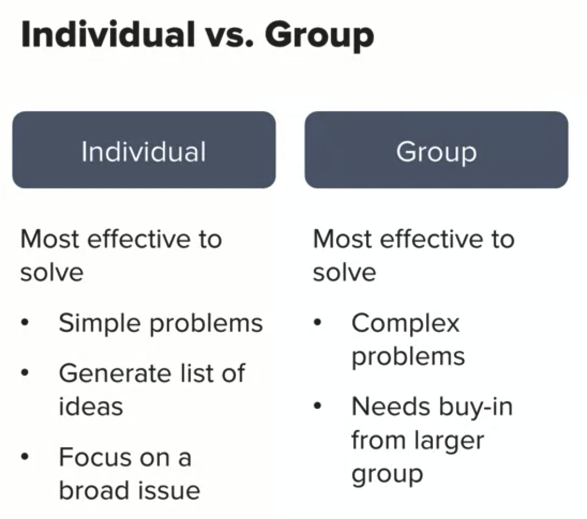

#### Individual Brainstorming

You don't have to worry about other people's egos or opinions, and you can be freer and more creative.

#### Group Brainstorming

With group brainstorming you can take advantage of the full experience and creativity of all team members. When one member gets stuck with an idea another member's creativity and experience can take that idea to the next stage.  You can develop ideas in greater depth with group brainstorming than you can with individual brainstorming.  Another advantage of group brainstorming is that it helps everyone feel that they've contributed to the solution and it reminds people that others have creative ideas to offer.  It's also fun, so it can be great for team building.

#### Technique for Combining Individual and Group Brainstorming

Let's learn a technique that combines individual brainstorming into a group brainstorming activity. This is a really great approach when blocking occurs. On a piece of paper, each person writes down their own reframed problem at the top of the page. This is the question that you created in step two to launch brainstorming. So for example, my reframed goal orient- goal oriented question is, what strategies can I implement to ensure that I eat healthy and still have time to meet my important commitments?  So then you pass the paper to the right, and the person next to you can write down an idea to solve your problem.

#### Brainstorming Guidelines

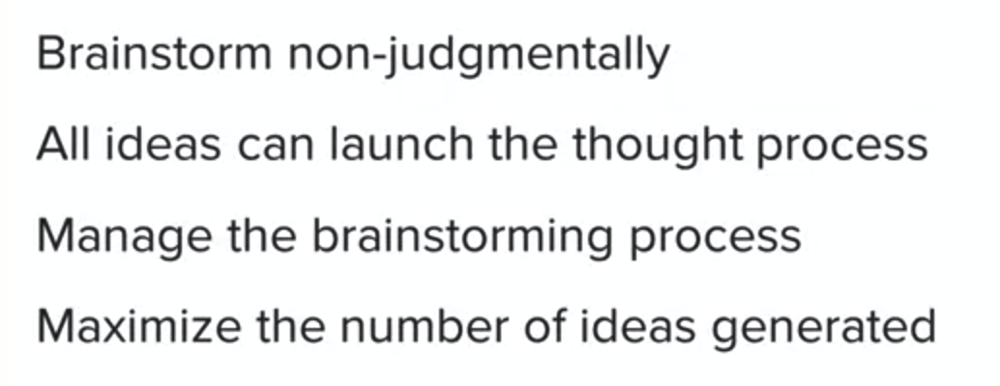

What about if someone has a good idea? Really, don't say, "hey man, that's a great idea." Seriously, why not? It's hard to not say that's a great idea. The reason we don't say it, is as soon as you say it's a great idea, there's a real pull to stop the brainstorming process and go with that idea. In the moment, it might feel like you're saving time, but in the end, it may not be that long-term solution. Resist the pull to judge, it's not easy, but it's the right thing to do. It keeps the flow of critical thinking going. To summarize, brainstorm non-judgmentally because some of the best ideas come from the ones that are the most ridiculous.  Because even a bad idea can launch the thought process for something that's good. It's better to have crazy and realistic, fun, outlandish ideas than none at all. Then you can pull back later and mold into something that works. You often get the best results of group brainstorming by managing the process according to these guidelines. By doing this, you can get people to focus on the issue without interruption, you can maximize the number of ideas that you generate, and you get that great feeling of team bonding that comes with a well-run brainstorming session.

After all your ideas are on the table, or the wall, or in [Google Jamboard](https://edu.google.com/products/jamboard/), begin to group the ideas together into similar ideas. Have everyone involved in the grouping, makes sure it's not left up to one or even just a few individuals. Why do you think that's important? Well, it's important for buy-in and engagement. When grouping those ideas together, take your time as a group and focus on one conversation at a time. It's easy for small groups to have side conversations and start deciding things in subgroups, really try to avoid that. You might even appoint someone to keep the group focused. You really want to keep everyone on the same page. Once you group the ideas, you'll start to formulate your solution. Here's a graphic to show how your mind-map approach helps you to categorize and wrap up your brainstorming session.

#### Brainstorming Summary

* Step 1
  * brainstorm non-judgementally
  * share ideas on post-its
  * group ideas together into themes

* Step 2
  * discuss and narrow down to 3 solutions

### 4. Choose the Top 3 Solutions

It is important to consider different solutions and different perspectives before continuing onto the advantages and disadvantages of each individual solution to consider all data points and stakeholders of the problem and its proposed solutions.

### 5. Advantages and disadvantages

* Success or failure?
* Long-term result or temporary fix?
* Potential outcomes?
* Who will support each one and why?
* Viable solution for long-term results?

#### Rubber Ducky

One of the things that can be really helpful is to picture yourself communicating these ideas and what do you think people's responses will be? How might this idea play out? What could possibly happen both positive and negative? What pushback will there be?  What potential subsequent problems might exist? Will this solution have any barriers as far as logistics or budget? Will leadership buy-in? Is it practical? Are there any communication challenges involved in rolling out this solution?  Other considerations might be around culture, rules, regulations, processes, procedures, human resistance to change, etc.

#### Resources

* [Dogs solving problems](https://www.youtube.com/watch?v=mQEmjNqwZRk)
* [Theo crosses the bridge](https://www.youtube.com/watch?v=m_CrIu01SnM)
* [How to think, not what to think](https://www.youtube.com/watch?v=6dluwVks444)
* [Brainstorming techniques](https://www.youtube.com/watch?v=2bNvs_qElIw)
* [How to use Google Jamboard (tutorial)](https://www.youtube.com/watch?v=S9m4HCjOkcA)
* [Quantitative Pros and Cons - MindTools](https://www.mindtools.com/pages/article/newTED_05.htm)

## Week 3: Prepare and Recommend

Ask common questions to prepare a robust recommendation by using critical thinking skills to show initiative and improve the odds of approval.

* What is your plan and timeline?
* What resources and needed for implementation?
* What potential questions might be asked by the decision maker?
* How will you ask for approval?

### 6. Prepare and Recommend

#### Be

* Confident and honest
* Calm and collected (not too excited)
* Open minded
* Organized and composed
* Respectful and prepared for a "yes" or "no"

#### Avoid

* Defensiveness
* Strong emotions
* Forceful, threatening, catastrophizing, aggrandizing

### 7. Engage Feedback

#### Saying "yes"

* Yes, I like it as it is, it looks great.
* That's a great idea. Could we just make these changes?
* I love that idea, I'd like to get a little bit more details on it though.
  * What caused you to go in that direction?

#### Saying "no"

* What other solutions were discussed?
* Well, that's interesting. Tell me how you got to that solution.
* That's really an interesting idea. You know, some other information that I think we should take a look at before we make our final decision is...
* Who all did you talk to before you came to that decision?
  * Recommend others be included on the decision
* Provide overlooked information or perspective to help develop another solution

#### Supplemental Critical Thinking and Problem Solving

There are 4 types of brain frequencies:

1. Alpha: 8 - 13 Hz
2. Beta: 14 - 26 Hz
3. Theta: 4 - 8 Hz
4. Delta: 0.5 - 4 Hz

**Beta Waves:**
* logical thinking
* problem solving
* managing daily activities

Note: when beta waves are in overdrive, we have **zero creativity**

**Alpha Waves:**
* bridge between  conscious and subconscious
* high creativity
* imagination & visualization

#### Resources

* [The Science and Art of Receiving Feedback Well](https://www.youtube.com/watch?v=t2d_O77F8-I)
* [Critical Thinking and Problem Solving: Make Better Decisions](https://www.youtube.com/watch?v=BX9bAWgiK4w)
* [Coaching vs. Feedback](https://www.youtube.com/watch?v=Z0XUEb_-T20)

## Course 3: Growth Mindset

### Week 1: Introduction

What you will learn:

* **Discuss** and **define** what is growth mindset
* **Contrast** growth mindset with fixed mindset
* **Discover** what is fixed vs. growth mindset
* **Apply** techniques to shift from fixed to growth mindset

Growth mindset shift exercises:

* Write out a script
* Engage in role-playing
* Help you implement an action plan
* Growth mindset is evolving and changing (we can iteratively improve)

What will you gain:

* Principles that are both theoretical and applicable
* Principles that are holistic and apply to all areas of your life
* Principles that apply as an employee and a supervisor
* Give and receive feedback using a growth mindset
* Stop being addicted to the fixed mindset praise

Who will benefit?

* Negative evaluation at work?
* Passed over for promotion?
* Failed at work?
* You genuinely want to improve your mindset for your career

### Foundations of a Growth Mindset

> Let go of who you think you should be in order to be who you are.  Be imperfect and have compassion for yourself.
>
-[Brene Brown](https://brenebrown.com/)

#### Fixed Mindset

Intelligence is static.  This leads to a desire to look smart and therefore a tendency to:

* **Challenges:** avoid challenges
* **Obstacles:** give up easily
* **Effort:** see effort as fruitless or worse
* **Criticism:** ignore useful negative feedback
* **Success of Others:** feel threatened by the success of others

#### Growth Mindset

Intelligence can be developed.  This leads to a desire to learn and therefore a tendency to:

* **Challenges:** embrace challenges
* **Obstacles:** persist in the face of setbacks
* **Effort:** see effort as the path to mastery
* **Criticism:** learn from criticism
* **Success of Others:** find lessons and inspiration in the success of others

##### Benefits Growth Mindset

We are more likely to:

1. Start
2. Stick with it
3. Stay hungry

##### Characteristics of Growth Mindset

* Intellectually curious, lifelong learners
* Creative (thus more resilient)
* Flexible and adaptable (thus handle change well)
* More collaborative
  * don't get stuck thinking their way is the best or only way
  * thinking on their own (not just following the group decisions)
* Failure is temporary setback which can be overcome
  * Feedback is accepted as constructive criticism

#### 4-Step Mindset Shift Process

1. Listen to that fixed mindset voice
2. Recognize the patterns
3. Identify areas you want to shift
4. Practice

##### Step 1: Listen

* To the fixed mindset voice
* Name your voice
  * Persona
  * Name
  * Label
* Gives you objectivity and distance (a perspective outside of yourself)

##### Step 1: Questions to Consider

* What happens when that fixed mindset voice shows up?
* How does it make you feel?
* How do you react?

##### Step 2: Recognize Patterns

What **triggers** the fixed mindset?

* Stress
* Anxiety
* Really busy
* Tight deadlines
* New or challenging projects
* Particular person or relationship

##### Step 2: Questions to Consider

* What circumstances or situations where you feel the fixed mindset?
* What events take you to a place of judgement and others?

##### Step 3: Identify Your Shift

Identify which patterns you actually want to shift to a growth mindset.  Pay attention to:

* How you react to mistakes
* How you react to challenges
* How you react to receiving feedback and constructive criticism

##### Step 4: Practice

* Focus on shifting to a growth mindset
* Practice the mindset shift exercises throughout this course

### New Pathways to Learning: Geeking Out on Neuroscience

#### [Neuroplasticity (2 mins video)](https://www.youtube.com/watch?reload=9&v=ELpfYCZa87g)
* The idea that our brain (neuro) can be molded (like plastic)
* What we focus on and how we discipline our thoughts and attitudes encourages brain growth in those areas
* New neural pathways are made
* What fires together, wires together
* Brain is like a muscle, so we need challenge and obstacles to grow

### The Art of Becoming

> The journey between who you once were and who you are now becoming, is where the dance of life really takes place.
>
-[Dr. Barabara De Angelis](http://barbaradeangelis.com/)

How do we bridge the gap between who we are and who we want to be?

1. Deliberate Practice
2. The Power of "Not Yet"

#### Deliberate Practice

Work that stretches us beyond our comfort zone.  Create plan and execute it to push the brain to grow.

* Be purposeful and systematic
* Requires focused attention
* Be deliberate and practice

#### The Power of "Not Yet"

A mindset reframe when we plateau and/or get stuck: "I can't do this... **yet**"

### Mindset is a Spectrum

Does mindset change?  Yes, many factors influence our mindset moments which vacillate from fixed mindset to growth mindset:

* the location and environment
* the people we interact with
* the project we are working on

Because our ephemeral mindset varies, we need to pay attention to how we are reacting in different circumstances and settings: work, family, community, friends, volunteer activities, sports, athletics, and hobbies.

### Organizations Can Exhibit a Growth Mindset

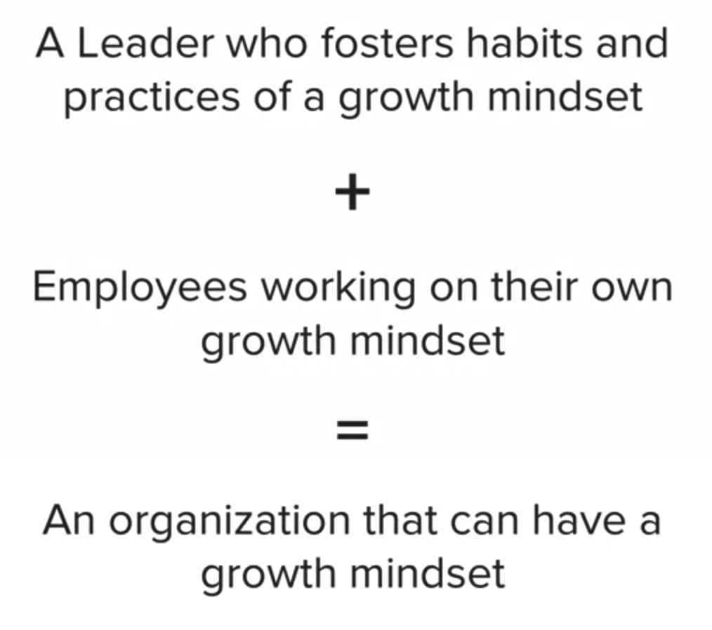

* Growth mindsets transfer from one domain to another
* People are the soul of an organization, so yes it can have a mindset

### Week 2: Internal and External Roadblocks to Growth Mindset

The first one is the biggest one because it deals with people.  People, can be an external roadblock to growth mindset.  Think of the people that you work with, the people that you live with and the people that you interact with in your life and your business and your career on a daily basis.  Think about whether or not these different people are actually holding you back by having their own fixed mindset.

#### 5 Myths (External Roadblocks)

##### Myth 1: False mindset

The first myth, has now been referred to as false mindset. That myth is that, if you are a nice person and you, let's say you're open-minded, that therefore you have a growth mindset, they're not synonymous. Although, being a nice person, and having, let's say this wonderful open-minded outlook in life, although that's a great attribute, it does not equate to an actual growth mindset. Let's remember, what is a growth mindset? It is the belief that you and other people and your abilities and knowledge and everything that makes up who you are, can be improved, and that you will learn from challenges and setbacks. That really doesn't have to do with being nice and it doesn't have to do with being open-minded, although those are wonderful things, they are separate from growth mindset.

##### Myth 2: Having a positive can-do attitude needs to be in place at all times

The second myth, is that having a positive can-do attitude needs to be in place at all times. This is a myth about growth mindset that has been used against workers often by leaders and supervisors. Sometimes workers have too much work. They just have too much on their plate and they are at capacity, and we cannot stretch the laws of physics and time and space, and yet your supervisor or a co-worker might say, well, you don't have a growth mindset because you don't have a positive can-do attitude about everything on your to-do list, and all of the projects on your plate. You know, sometimes having a bad attitude can be used against you, and again, I get that, it's a great attribute to have a positive can-do attitude. But it's not quite the same as growth mindset. Let's make sure we're not using against people productivity by saying, "Hey, if you can't keep up, then you are not growing and you don't have a growth mindset." Because remember, growth mindset again, is about the belief that you can continuously improve. But you can't continuously improve, if you have too much work to do within a specific framework.

##### Myth 3: Growth is unbounded or limitless

We like to tease that this can also be known, this myth, as anybody can be an opera singer, anybody can be Pavarotti, and that's not true. Some of us can improve our singing, but we will never be, let's say a professional opera singer. The idea that growth mindset is unbounded can actually hinder you from excelling at what you're really good at, and focusing on the job that you're supposed to be doing. Because you're always trying to improve in an area where there might be just a natural ceiling, and you're never going to excel beyond a certain level no matter how much you grow. Be careful with the false mindset of, growth mindset is unbounded or limitless because, it's not. You can get better at certain things, but you might not ever become, let say a master. Mastery might be out of reach just for certain types of abilities.

##### Myth 4: Growth mindset is only about praising effort

This one has been widely misunderstood, and it is a huge misconception in education and teaching. You might have heard the phrase before, praise the process, not the outcome. That's still not absolutely accurate for growth mindset.  We will talk a lot more about this when we get to module 4, and we cover how to give and receive feedback with a growth mindset in place.  But the quick way of talking about this is, what should you be praising?  Well, you should be praising not just someone's effort, because what if their efforts still lead to an ineffective outcome?  What you should be praising is, did they change things up?  What are the strategies that they put in place?  Did they ask for help?  A really great way around this is, instead of praising the process or the outcome, ask questions and show interest.  What did you do to improve here?  What did you do differently this time?  What type of strategies did you employ?  Did you ask for help, and from whom, and from where?  Actually showing interest in the process itself, but not praising the process, and not praising the outcome might actually be the way to go often.

##### Myth 5: Growth mindset means striving for business growth

We're going to talk about this a lot more when we get to module 3, and we cover growth mindset at an organizational and leadership level.  But I want you to think about it like this, growth mindset is about whether the people that work for that organization, including you, can be stretched beyond the abilities where you are currently find yourself.  It is not about the bottom line.  When you hear growth within business, people think you mean make more money, a bigger return on your investment, and that is not again what growth mindset means.  Don't confuse growth mindset at an organizational level, with the bottom line and making more money.  Striving for business growth is more about the people that work for the organization, and their mindsets and less about making more money and being more financially sound.

#### Internal Roadblock 1: Limiting Beliefs

You may have heard of limiting beliefs and they are exactly like they sound. They are beliefs that we carry about ourselves that put up a roadblock for improvement and a roadblock that's often difficult to overcome.

It often becomes a self-fulfilling prophecy when you believe in these limiting beliefs.  You don't pay attention anymore to the times when you actually prove yourself wrong.  So you don't notice or pay attention to the progress or even sometimes to the success.  It becomes a little bit of this self-fulfilling limiting beliefs cycle which we have to breakthrough.  One way to breakthrough it is to use your brain.  There is something in your brain called the **reticular activating system** or the **RAS**.  It often tells you what to pay attention to.  We're going to try to **retrain your RAS to pay attention to positive things and empowering beliefs** and to not focus as much on limiting beliefs **the thinker thinks** and **the prover proves**, and **we want to prove yourself wrong**. In order to shift to these empowering beliefs, we need to do a few things because **empowering beliefs are the opposite of limiting beliefs**.  Limiting beliefs often show up as absolutist thinking.  They often show up in these specific phrases such as, "I can't, I don't have, I'm not able to."  Basically, "I can't, I don't have, I'm not able to, or just I'm not; I'm not this, I'm not that."  What we want to do is we want to reframe this absolutist thinking to more growth mindset thinking and freezing.  In order to do that, I've given you two exercises:

##### Reframe Limiting Beliefs into Empowering Beliefs

One of them is called the reframe exercise. I'm actually giving you examples of limiting beliefs statements.  Your exercise is to reframe them so they're no longer a limiting beliefs, but they become empowering beliefs.  You'll see that it's a simple exercise, but it's a very powerful one.  Now to look at the way to reframe those, and then to make sure that you're doing that for yourself.

##### Triple Three Overcoming Limiting Beliefs Daily Exercises

That's where you list three limiting beliefs that you have around, let's say something having to do with your career, your job, your work, or your personal life.  Then you're going to list three things that you could do on a daily basis to overcome those limiting beliefs.  Then you're going to list three people that you work with, live with, or interact with that can help support you in moving to a more growth mindset and thinking about using empowering beliefs instead of limiting beliefs.

#### Internal Roadblock 2: Comparison Trap Syndrome

>Be a first rate version of yourself rather than a second rate version of everyone else.
>
-[Judy Garland](https://en.wikipedia.org/wiki/Judy_Garland)

That's basically a great way to sum up the comparison trap syndrome.  How does the comparison trap syndrome get in the way?  Fixed mindset people will have one of two things that they do with a comparison trap syndrome:

1. If they happen to be really good at something, fixed mindset people, because they're so defined by their abilities, will look down their nose at other people and become very much judges and not allies.  Instead of wanting to help other people get better, it makes them feel good that they're better than these other people at this particular task, skill, ability, etc.  They're not very good allies to other people and they're not encouraging other people to grow.

2. The second way that fixed mindset people get stuck in the comparison trap syndrome is when they're not as good as someone else at something.  They look at that gap between where they are and where they want to get to, in terms of improvement, as daunting. It's not motivating to them to look at other people and know that other people are already excelling in these other areas.  They're not motivated by it all, they're absolutely disheartened by it.

##### How to Overcome the Comparison Trap Syndrome

The growth mindset way of dealing with comparison trap syndrome is to look at where you are and where you want to get to and look at others who have already achieved the level of where you want to go and be motivated and inspired by it and try to learn from them. You look at where they got to as attainable and you want to know, what were the strategies?  How did they grow?  How did they stretch outside of their comfort zone? Then you want to try to employ some of those strategies for yourself.  It's a much better way of dealing with the comparison trap syndrome than a fixed mindset. Look at other people and go learn from them.  Don't compare yourself using a fixed mindset.

One thing that we can think of is watch great communicators and watch great public speakers and learn from them.  That's a way of shifting to a growth mindset in the comparison trap syndrome area where you're looking at others to learn more, as opposed to either feeling less than or being judgmental.

#### Internal Roadblock 3: Negative Self-Talk

I'm going to implement a rule for this course that I hope you can continue long after you finished taking this course, and it is called **the no negative self-talk rule**.  I'd love for you to implement this for yourself, and for those that you work with, your team, your staff members, your coworkers, and maybe some family and friends, because we can all benefit from it. Scientists have studied this, and neuroscientists believe that we all have about 60,000 thoughts per day. That's about a thought per second. Then out of those 60,000 thoughts per day, 95 percent of them, which is a large amount of them, are the same thoughts that you've had day in and day out. They become your habitual thoughts. Out of those habitual thoughts, the average person, 80 percent of those habitual thoughts are negative. Now let's do the math. That means that every day, the average person has about 45,000 negative thoughts. That's a lot of negativity that's going on. I like to tell my clients not to let the biggest enemy you have live between your own ears.  **The no negative self-talk rule means that you need to take all of the negative self-talk that you're giving yourself, either internally or even out loud, and you need to flip it and make it more positive because words are very powerful.**  If we're going to have all of these habitual thoughts that are looping through our brains every day, why not let some of them be more positive?

### Week 3: Organizational Mindset

An organization with a fixed mindset is often known as a culture of genius and an organization with a growth mindset is often known as a culture of development.

#### Organizational Fixed Mindset

An organizational fixed mindset is when the organization believes that it's employees have a certain amount of talent, and that's it. That they really can't do much more than what they'd been already hired to do and the talent level that they are exactly like a snapshot in time of when they're hired. Let's think about that because that usually stifles collaboration and innovation. It also can cause the very employees that they hired thinking that they were superstars for their specific level of talent for example, or genius. It can cause those people to become very competitive with each other, to become very judgmental and to get very set in their ways. It really stifles growth on an organizational level and it also can mean that they're not going to be a lot of people that grow in their potential and level up to leadership, if that is what they might have been able to do in a cultural development. Organizations with a fixed mindset that hire solely for a certain amount of talent and not for people's potential, actually stifle growth

#### Organizational Growth Mindset

They have significantly more positive views about their employees. They believe that their employees can learn and grow. They hire them not only for the talent they have right now, but for the potential to develop in the future. They often see people rising to the level of leadership that they might not have seen if those people were in a culture of genius, otherwise known as a fixed mindset organization. In these particular organizations where they foster growth mindset, again, you can see innovation and lots of collaboration going on. People aren't as afraid to take chances and they're not as afraid to stretch and grow and really, really live up to their potential.

#### Fostering an Organization

The key is to maintain high standards, but to do so in a nurturing and developmental type of environment.

1. The organization values learning, improvement, and perseverance (not just ready made genius and talent).
2. Position supervisors in your organization as resources for learning.
  * So you don't want to just position your supervisors as people that are judgmental and that just basically constantly keep employees in line or reprimand. But as people that your employees can go to as a resource for learning and to talk about process and improvement, and setbacks and mistakes, and maybe ask them for lessons learned, how did you overcome this obstacle? How did you learn this?
  * You also want people to be able to come to your supervisors and ask for assignments to be delegated to help them improve their skill set. And so, if you are a supervisor, you want to think about delegating to the people on your team not just to get work off your plate, which I understand is a reality but to also improve their skills and their talent and help them grow.
3. Present skills as learnable.
  * So you want to create a space where learning is cultivated, and people can easily and freely talk about setbacks and failures.
  * And if you're a supervisor, this might be something that you incorporate into a weekly or monthly staff meeting. Say okay, anyone have a failure or a setback in the last week and learn from it and even just having that conversation would help foster a growth mindset.
4. Place a value on the development of your employees.
  * If you're the supervisor, are you creating learning experiences for them such as trainings and workshops? Are you coaching them? Are you giving them stretch assignments?
  * If you're a co-worker, what can you do to foster more learning and place a value on the development of you and your team members?
5. Giving feedback in a way that promotes learning and future success.
  * So oftentimes when we're giving feedback, we're, we're working too much to give feedback in a way that seems like it's, they call it constructive criticism. But it's just kind of mean spirited, or it's just pointing out what was done wrong, but not in a way that helps someone developer learn.
  * So think about giving your feedback. In a way that actually get someone out of a fixed mindset, and helps them look towards the future with a growth mindset. So remind them of a time when they were successful at something that they didn't think they could originally do. And if you're getting the feedback, ask your supervisor. For ways to improve, and ask your supervisor how he or she learned this and excelled, and if he or she was always good at it, or if it was something that maybe they had to work at.

#### Qualities That Lead to Growth Mindset in an Organization

* Innovation - thinking outside the box, first to market, early adopter
* Flexibility - ability to change and pivot
* Motivated employees – eager to learn
* Empowered workforce - comfortable taking risks, making decisions, bringing new ideas
* Compassion for employees – investing in their development

#### Everyday Compassion at Google

[TED Talk: Everyday compassiom at Google](https://www.ted.com/talks/chade_meng_tan_everyday_compassion_at_google?language=en)

##### Compassion creates highly effective business leaders.  There are 3 components of compassion:
  * Affective: "I feel for you"
  * Cognitive: "I understand you"
  * Motivational: "I want to help you"

It takes a special kind of leader to move companies from "good" to "great.  Highly capable leaders are humble and ambitious (for the greater good).

#### Compassion creates an inspiring workforce as employees admire and respect each other towards greater good.

1. Create a culture of compassion for the greater good
2. Autonomy to allow employees to choose how to solve problems
3. Focus on inner development and personal growth

##### Fostering Compassion

1. Attention: basis for all cognitive abilities via a calm mind
2. Self-mastery: clearly see our thoughts and emotions in the moment
3. Mental habits: "I want you to be happy" -- a good habit for external thoughts when interacting with people

#### Fixed vs. Growth Mindset of Leaders
##### Fixed Mindset of Leaders

Well, they simply look for existing talent and they judge employees as competent or incompetent at the start, and that's that. It often causes them to not be able to see the growth, and so even when someone on their team is growing and is improving and is doing something fantastic and innovative, they don't see it. Their initial impression is the one that they always hold in their mind, and they sometimes don't even take notice, which is really sad. It's very limiting fixed mindset believe. They're also less likely themselves, these leaders, to seek or accept critical feedback from their employees and from their team. Why get feedback if they can't change? They do relatively little developmental coaching of their employees because again, why waste my time on that when they don't think you can change? That is a very fixed mindset leader or fixed mindset manager approach

##### Growth Mindset of Leaders

They think it's a really nice to have talent, but that's just the starting point. They are more committed to helping you develop and grow. Because of that, they're going to take notice of improvements and changes, and they're going to give you a little more developmental coaching and feedback because they think they can contribute to that changing growth. They also are more likely to listen to you when you come to them and give them some feedback in how they could be a better manager to you or listen to you when you talk about certain assignments, tests, and talents that you want to improve. It's a little more of a two-way street.

#### Fixed vs. Growth Mindset of CEOs

CEO disease: it's when a CEO reigns from atop of a pedestal and wants to be seen as perfect. They even sometimes let the organizational ship go down because they can't save it because they're too concerned with their own fixed mindset. In this type of setting, everything revolves around pleasing this boss. Because of that, the leader becomes the main source of stress. It's what people worry about, it's what they focus on, and that stagnates growth for the entire organization and it also hinders performance and innovation at teamwork. Everyone that works for this type of CEO who has this fixed mindset CEO disease feels judged. Usually, they're not performing at their best and it's all about the outcome and it's never about the change, and the innovation, and the collaboration, and the growth. If you fail and you are not the best, then it's all been wasted in the mind of this type of CEO.

#### Growth Mindset Leadership

Leaders with a growth mindset believe that others have talent and intelligence as a starting point, but that it can be cultivated, and grown, and developed, and improved. Because of this, it's really interesting because people that have a fixed mindset, what do they really want? They want to get to the top, they want to prove themselves and be considered the best. That's a way they very much define themselves. But the people that wind up often getting to the top, getting promoted, and moving up in their careers are people with a growth mindset. It's because they have this natural motivation and growth potential. They are enthusiastic about their work and their learning all along and improving.

##### 3 Key Behaviors of Growth Mindset Leadership

1. They tell growth mindset stories. They're not afraid to talk about how they grew, what their setbacks were, and they're not afraid to point out examples in others either, to show how others have grown and overcome obstacles and setbacks.
2. They don't fear feedback and failure. Failure to them in themselves and others is just an obstacle or a challenge to be overcome and learned from. Feedback, either getting it for themselves or giving it to others, again, is an example of a way that people can improve, and so they don't fear it.
3. They reward effort, not just outcomes.

#### Best Practices for Growth Mindset at Work

* Remind yourself that people can develop their abilities.
* Think of areas in which you or someone else had low ability, but now performs at a higher level, or learned to do things you never thought you could do.
* Change the stories you tell to team members.
* Celebrate your mistakes or failures and how you learned from them.
* Reward your own efforts – without ever having to tell your supervisor you’re redefining the goals for your own success.

#### Positivity Quotient

Your optimists truly believe that things can go right and they believe that if they keep plugging away at their goals, they will succeed and so you've heard the phrase, the glass is half-full and that's exactly how people describe an optimist. A pessimist has very fatalistic or negative thinking and despite maybe lots of effort, they truly believe things will go wrong. It's difficult for them to move forward with things because they have this very fatalistic view. Again, you've heard the concept that, the glass is half empty, which is a very negative way of looking at it. There's a third level of the positivity quotient and it is called the defensive pessimist. A defensive pessimist is someone that doesn't just focus on whether something can go right or doesn't just believe something will go wrong, but they look ahead. They look into the future to determine what might go wrong and how to avoid it. They only go into this pessimists side as a way to defend it so that it doesn't happen and they are extremely useful to have on your team.

#### Overcoming Group Think

1. Ask for and use the expertise of your team members. Cultivate trust by showing respect for their views, for their knowledge and empathy, for the fact that change is difficult, but that they want to bring up change and they want to sure that they are heard.
2. Another way to cultivate collaboration and overcome group think is to discuss the potential changes before they're implemented. This one is so important. When people have a chance to have a say in the changes, they are more invested in them. So ask your team members to state what changes need to be made, when and how to implement them.
3. Be a defensive pessimist and look at what could go wrong and why to plan for that in advance.
4. Assign people the role of devil's advocate to say, I want you to research the opposite of what we're planning to do, and are there any other alternatives to what we're planning to do? Could you take an opposing viewpoint to see if there are holes in what we're planning to do. So get people to debate the issue and to look at it from different sides.
5. Have an old-fashioned suggestion box that's anonymous, where people actually have the right to voice their views. You could do that digitally, you could do it in old-fashioned way where people freight on an index card or piece of paper. Remember that people can be independent thinkers and still be team players.

#### Navigating Change

> I can't understand why people are so frightened of the new ideas. I'm frightened of the old ones.
>
-[John Cage](https://en.wikipedia.org/wiki/John_Cage)

Change is a new beginning. For some people that means mourning the loss of what's ending. A lot of fixed mindset people will hyper-focus on what's changing, what they're leaving, what they're running away from, as opposed to focusing on what they're going towards, what they're running towards, what the change may bring, and the fact that it may bring something better. The growth mindset way of looking at change is that yes, it's a transition, but it's a learning process and it's a growth process, and therefore it's one to be embraced as much as possible.

##### Key Questions to Process Change

Questions to help you overcome the resistance to change by using a growth mindset:

1. What is changing?  What actually will be different because of the change?  In reality, sometimes we make it bigger than it really is. The change itself may be huge, but maybe the result or the outcome isn't that different for you in particular, maybe it doesn't affect you on a daily basis.
2. What will remain the same?  That's a great thing to focus on, especially if change is difficult for you and you find yourself falling into the fixed mindset around change. Think about what's going to be the same.
3. Who is going to be affected and in what way? This change might not affect everyone equally, it might not affect everyone at all.

##### Growth Mindset Change Qualities

Growth Mindset people not only deal well with change, but welcome and thrive on it. Here are the qualities of people who embrace change. Try to focus on these qualities and foster them in yourself and your co-workers.

* **Confidence:** Self-confidence is always a winning quality. Its value is never more evident when welcoming change at the workplace.
  * Focus on strengths, not weaknesses to keep your confidence up.
* **Loving a Challenge:** Those who love challenges often look forward to exciting changes at work.
  * Emphasize optimism. Focus on opportunities that come with change, not the natural uncertainty and potential negatives. These opportunities typically include the ability to grow, gain knowledge, overcome challenges and earn recognition.
* **Adaptability:** Those who are adaptable deal well with changes. They resist becoming overwhelmed or discouraged. These people simply “go with the flow.”
  * Keep your sense of humor and levity. People can cope with change much easier when the mood is lighter.
* **Good Work-Life Balance:** Most people that have a sense of balance in their lives, between the personal and professional, adapt well to change. It seems that those employees that have other interests, beyond the workplace, deal with change much better than those who are “married” to their jobs.
  * Try to have other, meaningful life experiences. Foster a real life, hobby, pastime or other interests.
* **Creativity:** Employees who are naturally curious tend to embrace change as a new adventure in gaining knowledge and fueling their inherent creativity.
  * Nurture your creativity and innovation, and that of your co-workers.
* **Love of Collaboration:** Those who like collaborating with a team to achieve solutions often thrive on change.
  * Take the time to sharpen your collaborative skills.

**Self-Reflection:** Can you think of someone in your organization that embodies one of these change qualities and tap into them as a resource or mentor?

##### Change Exercise (Suggested Activity)

Change Exercise – Choose Your Own Change Activity. Select one. Or if you want to practice a Growth Mindset, do all 3!

1. Take a moment to review the 6 Growth Mindset Change Qualities (in the previous reading) and think about which ones you’re already strong at, and which ones you need to develop a stronger strategy for or build a team of people who possess the skills you’re lacking

2. Think of something that you’ve always wanted to try, but were afraid you wouldn’t be good at it or excel. Make a plan to try it with a Growth Mindset. Think about the learning, challenge, confronting obstacles. Think about the effort as a positive, constructive force, not as a drag. Share what your stretch exercise is with your peers and ask for input.

3. Think of a change that is happening now at work, that is about to happen, or could happen in the near future. Consider how you will handle that change using the strategies we covered. Choose a partner and share what the change is, and how you plan to incorporate Growth Mindset techniques. Be creative, but specific. Share your intentions with a colleague or friend, and put them in writing.

### Week 4: Dealing with Setbacks and Failures

In this module, you will be able to overcome the perfectionist syndrome. You will be able to identify how your mindset will show up. You will be able to practice the five-minute pity party and apply a growth mindset to move forward. You will be able to reframe a situation and make it redemptive. You will be able to apply best practices to giving and receiving feedback and be able to identify that there is a balance to practicing a mindset.

#### Perfectionist Syndrome

In order to overcome the Perfectionist Syndrome, you need to think progress, not perfection.  Are you able to ask of yourself and others for full commitment and for full effort as opposed to mistake free actions? I want you to really think about that. Because that means that not only can you cut yourself a lot of slack if you make a mistake, and just ask yourself, did I give full commitment and did I give full effort? Am I willing to learn from the mistakes and setbacks and grow from them? But you also need to do that for other people and give them some room for mistakes and for growth also.

In a fixed mindset, when someone has a setback or failure, they view it as a very permanent state and a reflection on their overall abilities and talents. They also do not like to focus on effort because when they make a mistake, they look at it as deficiencies and deficiencies in the mind of a fixed mindset person have no place.  A fixed mindset individual, the failure is such a negative statement that they will torment themselves over it and ruminate over it. They will often try to blame others. They go into that comparison trap syndrome that we talked about in module 2. When they get into that comparison syndrome, instead of trying to learn from their mistakes and setbacks and grow, they look to others to blame them. They often sometimes go as far as cheating.  This type of fixed mindset in the area of setback and failure, can really be a problem and can hinder overall team dynamics, and can hinder relationship-building, and can definitely hinder your growth in your career.

Whereas a growth mindset person will handle setbacks and failures a lot more easily because they leave room for course correcting, for tweaking, for dealing with errors. They also leave a lot of room for learning.

#### The 5-minute Pity Party

> You aren't a failure until you start to blame.  You can stil be in the process of learning from your mistakes until you start to deny them.
>
-[John Wooden](https://en.wikipedia.org/wiki/John_Wooden)

> If we operate from a fixed mindset, that we view failure as defining us instead of viewing it as a temporary situation that can be used as a stepping stone to future success.
>
-Christopher Bergland

The 5-minute pity party gives you the permission to vent and complain about your failure. Then at the end of the 5-minute pity party, and yes, I'm going to ask you to time it, then you talk about or think about or plan for how you're going to move into a growth mindset to deal with that same setback or failure that you've just been ruminating over for five minutes.  At the end of the five minutes you need to think about what am I going to do about this? How am I going to reframe this? What actions might I take?

Time yourself for five minutes thinking about something that you know that you have a fixed mindset about, and then I'm going to ask you to think about the following questions: What happened during those five minutes? What did you do? Where were you? What did it feel like? How did it feel during those five minutes? What are your action steps to move to a growth mindset about the issue that you're pity partying over?

#### Redemptive Story Reframe Exercise

I'd like you to use a three-part exercise. Part 1; think of something from the past that you think measured you or defined you in some way that most people would consider a setback or failure. Here are some examples. A poor test score, not getting into a college or graduate school program, being passed up for promotion, a big mistake that you made at work that you really think affected one of your assignments or affected the trust level that your supervisor had about to you or even being fired from a job. So that could be the setback or failure that you use. Think of an example of one and let's make it about your career. Part 2, put yourself into the growth mindset, look honestly at your role that you played in this set back or failure. But understand that it does not define you, it does not define your intelligence, your personality or your overall career. Step 3. Now, staying in that growth mindset, ask yourself what you learned from that experience and how can you use that experience as a learning basis for future growth. That's the redemption part we're going to redeem this past setback and reframe it using a growth mindset so that we can learn from it

#### Giving and Receiving Feedback

In a fixed mindset, both positive and negative labels can really mess with your head. For example, if someone at work, let's say your supervisor, refers to as the superstar on the team or the best speaker or my best salesperson. That actually is something that you feel you have to constantly live up to. You're afraid of losing that label. Let's  say that you're referred to with something more negative. "She's my slow salesperson, she closes deals, but it takes her forever or he doesn't like to speak up at meetings, he is so quiet, and they say it in a negative way." The problem with those negative labels, if you're a fixed mindset person is you feel you deserve it and that there's no way to overcome that. It's insurmountable. The fixed mindset puts you in a really difficult position when it comes to feedback because you're paying a lot of attention to those labels.

If you have a growth mindset around how to handle feedback, and let's say for example, labels or stereotypes, whether they come from your supervisor or someone else, you can handle them a lot more easily and gracefully. The reason is that you don't think they define you. They're not an overarching way of defining your abilities and your talents, and your ability to grow because you constantly think, well, "I can work harder, I can seek help and I can improve," and so using a growth mindset to take in feedback and take in criticism and take in labels, for example, is a great way to reframe those types of experiences.

Let's talk about a difficult situation now. What if you have a supervisor that has a fixed mindset about your work? What if you have a supervisor that has a fixed mindset about your actual abilities, they have a snapshot in time and they always see you that way, and therefore, they're not even seeing your improvement in your performance over time. It's difficult but you have to actually have a growth mindset in the way that you handle their fixed mindset. You have to try to respond to that with a growth mindset to help you see that someone else's view of you is not the be-all end-all, and it should not define you and take away your confidence. With that type of growth mindset, you're better equipped to confront the feedback as temporary and to keep your confidence, and your abilities in tact.

##### Giving and Receiving Feedback: Best Practices

1. The definition of constructive criticism itself needs to be broken down and redefined. It is not an invitation to personally attack someone. Basically, constructive criticism is a way to praise or critique the efforts, strategies and solutions, not the person, him or herself, so any feedback should be initiated by ensuring that the purpose behind it is to seek improvement and not to reprimand or rebuke someone else. That helps employees, whether it's you or someone else, come to this constructive feedback conversation in a way that's not defensive and very open to feedback. That's how you foster a growth mindset from the beginning of the conversation. Make sure that you're looking at the performance, let's say the outcomes, the achievements and the traits, and not the person, him or herself. It's very difficult but it's a really important thing to do is to reframe constructive criticism itself, not about the person, but about the assignment, the task at hand.

2. Really look at the language that you use, either in your writing or the language that you speak. Make sure that it is done in a way to actually incite a positive outcome and growth mindset. How is the feedback conveyed?

##### Reframe Example Exercise

In this lesson, we will continue talking about receiving feedback with a growth mindset. We're going to go back to our personas and this time we are just going to focus on Thomas. I'm going to give you a little scenario where Thomas receives an assignment back from his supervisor, and he's going to approach the feedback with a fixed mindset. Then I'm going to ask you to reframe his response to it using a growth mindset. Let's first have Thomas explain what's going on. But again, remember he's in a fixed mindset. ''My boss gave me back an assignment and it had revisions written all over it. I was so disappointed. I felt like such a failure. I tried to avoid our one-on-one meeting later that day because I didn't want to face her. I was trying to make up an excuse to not attend. I feel like a loser, and I should have really nailed that assignment." What I want you to do now is reframe this for Thomas using the growth mindset.

Your exercise was to try to rephrase and reframe the way that Thomas responded to the feedback from his supervisor when he got back the assignment that he felt that he had been a failure around. What does that look like? I'm hoping that you came up with some great examples and there are lots of correct answers. But here's one, "My supervisor gave me back an assignment that I worked really hard on and she actually took the time to make comments on it and then invited me to talk about it in a one-on-one with her so that I could better understand her feedback. I went to that one-on-one and I used it as an opportunity to ask a lot of questions and I took a lot of notes. I can now see how I can improve on that type of assignment in the future. I asked her if she would give me a similar assignment soon, so I can apply what I've learned." What a difference. That is the growth mindset in action when receiving feedback. Now, to be fair, remember in the last lesson we talked about how if your supervisor has a fixed mindset about your abilities, it's often difficult to reframe the feedback, but you control your response to the feedback. Always try to put yourself in a growth mindset when receiving feedback and you'll be able to handle it a lot better and define it as a temporary setback for failure that you can learn from.

##### Self-Reflection Activity

* Do you feel you need to prove yourself in the workplace, to be the best, be a “success”, and that gets in the way of your helping others?
* Do you often take credit for wins and not give attribution to the team?
* Do you ever try to hold back high-performing employees because they threaten you?
* Do you have a fixed mindset about a particular colleague?
* Are there ways I could be less defensive about my mistakes?
* Could I profit more from the feedback I get?
* Are there ways I can create more learning experiences for myself?

##### Reality Check of Growth Mindset

One thing to remember, and a good example of a growth mindset is to be sensitive to others. You don't want to seem to be saying to someone that is directly or indirectly impacted, "just have a growth mindset." Remember, going back to module 2, we don't want to confuse growth mindset with expecting someone to handle extraordinary circumstances and always in a positive way. But ask yourself, "what can we learn from these situations that would be useful in the future?"

A growth mindset can be extremely helpful during times of stress or change. But remember that there is sometimes a reality check situation when the balancing act maybe a little more difficult. When those situations come up, be aware of them and cut yourself some slack. That as much as you're trying to do a mindset shift, this may not be the perfect time to expect that of yourself.

#### Mindset Summary

The growth mindset is ongoing. Remember it's always changing.

1. Change your mindset about mindsets. Which means that be careful that you're not falling into the trap of thinking that fixed mindset is so negative and so bad that you can never admit when you're in it. We have to all recognize that we are a combination of fixed mindset and growth mindset around lots of different areas. Remember, I want you to think of this holistically. You may have a fixed mindset around one ability but not another. You may have a fixed mindset around one relationship but not another. Your fixed mindset may arise more in certain settings than others, and just be careful that you're not so judgmental of yourself that you won't even admit when you're in a fixed mindset. Because recognition of when you're in a fixed mindset helps you shift to a growth mindset.

2. remember that mindsets are not permanent. You can change yours even in areas where you fall into a fixed mindset, does it take work and practice? Yes, and you now have a lot of strategies to help you do that. Remember that you can change, which is great. Really hopeful. Remember to remind yourself that you are a human being and you're a work in progress.

3. You want to catch yourself when you're slipping into the fixed mindset persona, and you may need to again, talk to your fixed mindset persona. It thinks it's protecting you when what it's really doing is limiting you. You may need to actually have a little conversation with this fixed mindset side of yourself and remind yourself, we need to move to a growth mindset because this is not helping us. You're going to have to educate that fixed mindset persona here and there.

4. Learn your triggers. There are some things that will be common triggers for you and will put you more in fixed mindset personas than others. Let me give you a little bit of a list of those. One is when you fail. Another is when you keep hitting dead ends. Another one may be that comparison trap, rearing its ugly head. Either you become judgmental of others or you become very judgemental of yourself, and when you do that, either of those can put you very much in a fixed mindset. When you feel vulnerable, when you're stressed out, when you're anxious, and also when you're taking on maybe a big new project or a big deadline, or just a really tough challenge that you haven't experienced before. All of those can be common triggers, but think about what the triggers might be for you as you've been studying this fixed mindset persona. When does it tend to arise for you? What types of settings, with which types of relationships in people and under what types of circumstances?

5. Growth mindset takes practice, and so use what you've learned in this course as you move forward. Keep thinking about writing out a script to reframe and rephrase statements. Keep thinking about role-playing and practicing. You may need a growth mindset buddy to help you through this. The more you can remember that growth mindset takes practice and that you are a work in progress. But that you can shift over to a growth mindset when you need to more and more hopefully in the future, then this will give you hope as you move forward.

#### How to Develop a Growth Mindset in Your Career?

* Don’t be afraid to take calculated risks.
* Encourage employees to accept their limitations rather than hiding them.
* Consider challenges as opportunities to improve themselves.
* Try out a variety of approaches rather than taking the same approach to every situation.
* Don’t wait to get approval for your ideas, rather make learning a priority.
* Enjoy the process of learning instead of anxiously waiting to enjoy the end result.
* Celebrate small wins with other teammates and be a part of their wins as well.
* Be patient while learning as opposed to rushing through the learning process.
* Make sure efforts are acknowledged and not just the end results.
* Ingrain in your work culture that ‘high achiever’ means someone who leverages hard work as well as their skills.
* Do not view constructive criticism in a negative manner but use it positively to overcome your limitations.
* Focus on progress, not perfection.
* Make regular learning a part of your routine and stick to it.
* Understand that your brain requires regular exercise like your muscles to stay fit and coherent.
* Value determination and perseverance over street-smart and shortcuts.
* Embrace your own mistakes, and learn from your teammates mistakes as well to avoid repeating those mistakes.
* Raise the bar once you reach your goals as there is always room for higher achievement.

# Course 4: Adaptability and Resiliency

**Real improvement is about practice, continuous review, and development.**

Remember, it's also important to realize that this program can only take you so far. You'll also need to be motivated and open to learning. Be prepared to genuinely reflect, try new things, and to challenge yourself.

**Adaptability and resiliency give us:**

* Ability to access an evolving situation from multiple perspectives
* Shift thinking and viewpoint
* Choose the best response

## Week 1: Laying a Foundation

**How important is adapability?**

In our VUCA world, adaptability is everything.

VUCA = **V**olatile **U**ncertain **C**omplex **A**mbiguous

> To survive in today’s constantly changing business landscape requires being comfortable in uncertainty. Adaptability is what allows people and businesses to solve problems, overcome challenges and move back from the edge of attrition to the more stable ground of relevance. Adaptability is everything.
>
-Jeff Boss, Forbes

### Learning Goals

* Identify attitudes and behaviors of adaptable and resilient people.
* Understand the importance of both traits in today’s organizations.

### Adaptability

**Able to change:**

* Actions
* Course
* Approach

This implies a sense of personal choice or purposefully navigating rather than being driven by changing circumstances.

**We have 2 choices:**

1. We have the ability to change our situation
2. We are at the mercy of situations in which we find ourselves

**What does adaptability look like?**

* Willingness to learn new ways of thinking
* Being curious and open-minded
* Attending a meeting you don't want to be in and using active listening skills to learn
* Being alert to positive aspects of change
* Focused and energetic when learning new processes or techniques
* Saying "yes" to the new project that will stretch your skills
* Being self-reliant, able to initiate, improvising where needed
* Being flexible to approach tasks
* Being able to multitask
* Being tolerant of tight deadlines
* Ability to bounce back from setbacks and unexpected obstacles
* Being able to learn from experience and do things differently the next time if need be

😟 Without adapting to change, a leader's effectiveness is both limited and limiting because inflexibility not only precludes one's personal growth, but also precludes the growth of one's followers.

#### Adapters

* Flourish amidst chaos while inflexible, non-adapters flounder
* Find openings in situations where others only see closure

### Resilience

Capacity to recover quickly from difficulties and ability to bounce forward with new insight and learning.

* Grit
* Staying power
* Persistence
* Digging deeper to find inner reserves of strength during times of challenge, change, or stress

### Characteristics of Adaptability and Resilience

* self-awareness
* self-management
* strong connections
* practicing a positive attitude

### Ripple Effect

How you choose to show up and engage with others has an effect on your colleagues, your friends, your family, your community, and your organization.

### Top Qualities for New Hires

1. Understand their own path
* Can you tell your story?
* Can you talk about your path going forward?  What are your goals?

2. Know what they want in their career
* Self-directed
* Know what they want and are willing to work for it
  * You have a reason
  * You have goals
  * Willing to pay more attention to the work (compared to others just working a job for a paycheck)

#### How Employers Rate Adaptability

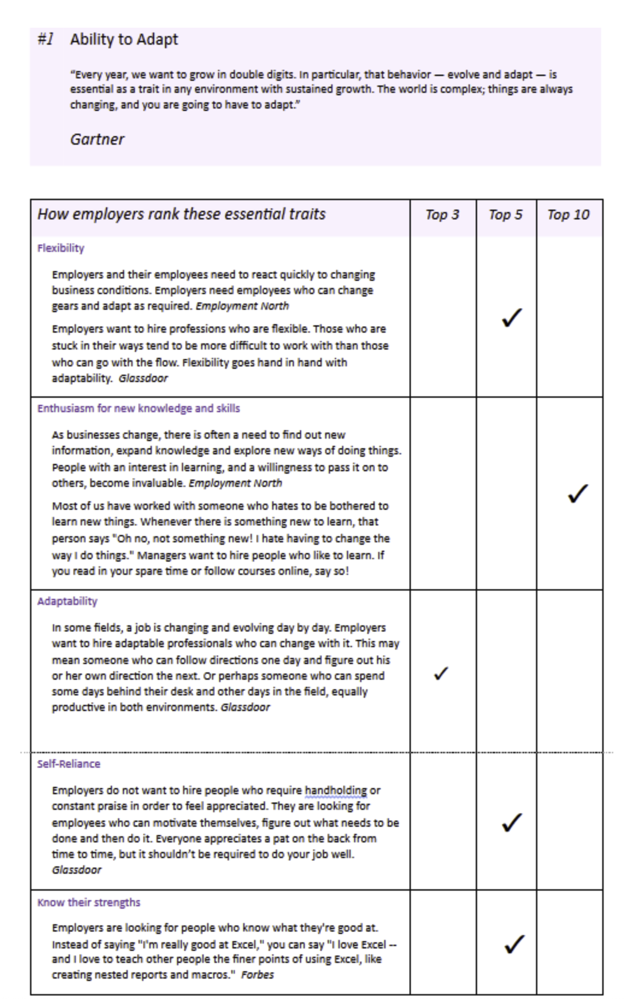

### Adaptability and Resilience Assessment

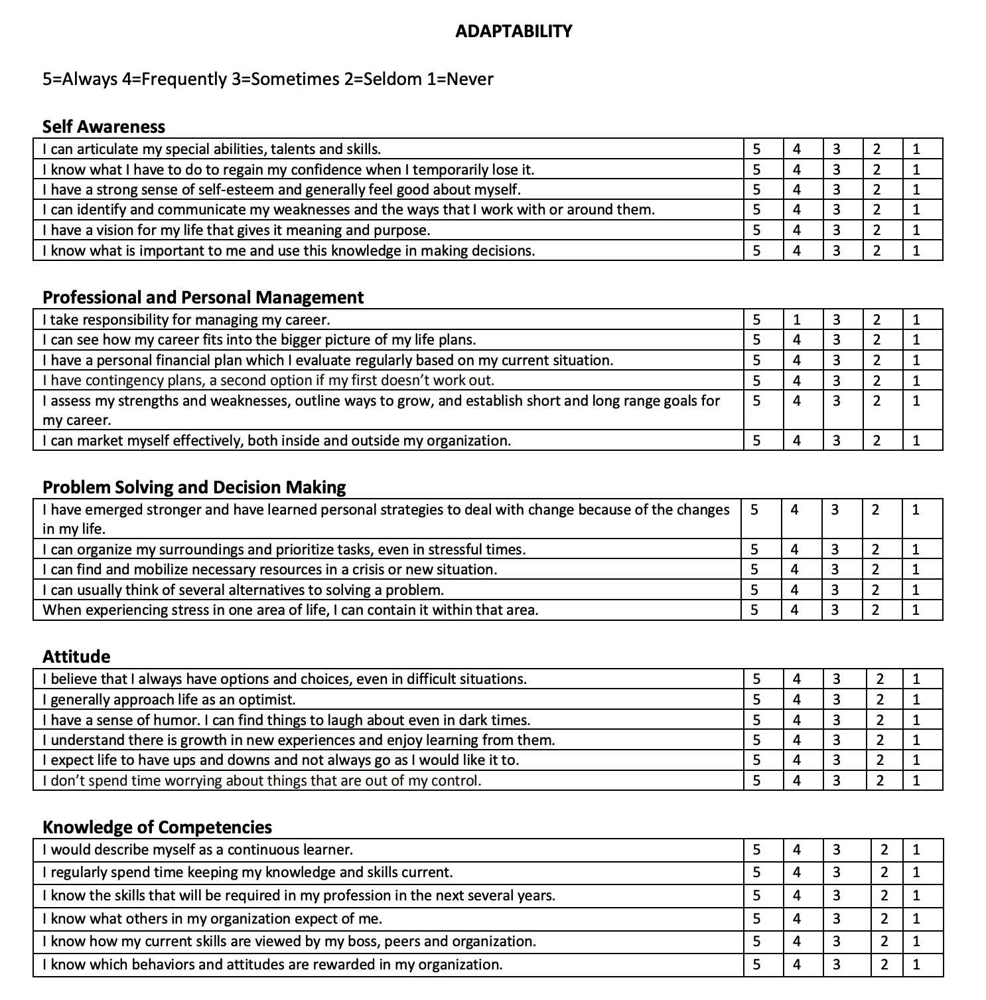

## Week 2: Introduction to Self-Awareness

### What is Self-Awareness?

The ability to see yourself clearly and objectively through reflection and introspection.

Conscious knowledge of your own:
* Character
* Feelings
* Motives
* Desires

The foundation of self-control is formed by holding ourselves accountable to our own standards.

### Think About

* Clarify your personal values and beliefs
* Understand both your strengths and blind spots
* Identify triggers that evoke negative thoughts and feelings
* Modify any negative self-talk
* Develop behavioral strategies when faced with setbacks
* Improve your ability to convert failure to learning
* Become more proactive
* See things from the perspective of others
* Understand people better and improve your relationships
* Practice self-control
* Make better decisions
* Become more creative and productive

### How to My Expectations Align with my Employeer's Expectations?

⭐️ In a **VUCA** world, disruption and innovation are everyday realities.  Key to staying relevant is your ability to analyze evolving needs and stakeholder expectations.

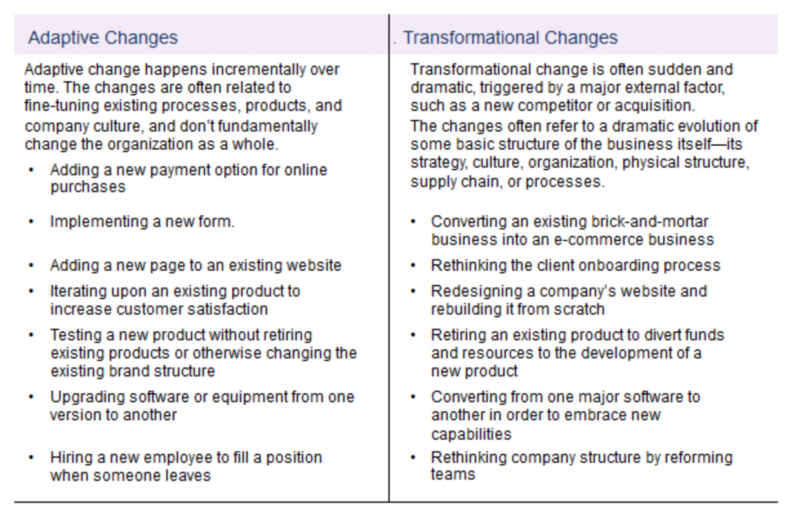

### Discovering Ourselves and Our Standards

#### Reflect upon the assessment from last week:

* How would you evaluate your ability to adapt to your org changes?
* How adaptable are you?
* Can you remember adapting comfortably to many challenging situations?
* When have you found it difficult to adapt to changing situations?
* When have you learned a new process?
* How have you redesigned a product or a service?
* How have you worked with a new team?
* How have you handled changing to a new intranet, shifting to virtual meetings, or sharing ownership of a product?

#### Think about:

* What are your personal and professional values?
* What are your standards and your expectations for yourself?
* How do you tend to value yourself?

#### Outcomes:

1. We pass or find alignment between ourselves and our standards
2. We fail and find discrepancy between ourselves and our standards

#### Gaps Between Our Outcomes:

We can choose to:

1. work towards reducing the discrepancy
2. avoid it entirely

#### Self-Awareness

If we believe there's a little chance of closing the gap, we tend to avoid the issue. But if we're optimistic and believe we likely can improve our alignment with our standards of correctness, we'll take action. Our actions may also depend on how much time and effort we believe realignment will take. The larger the perceived gap between our responses in our standards, and the slower the progress will likely be, the less likely we are to take on realignment efforts.

What many people don't realize is that you can learn to recognize situations that trigger a threat response, and you can learn to manage your thoughts and feelings about that situation. Controlling your inner responses will greatly increase your ability to adapt and grow from the new experience.

#### SCARF Model

1. **S**tatus: your sense of relative importance to others, often associated with being the expert.
2. **C**ertainty: your ability to predict the future. People don't like uncertainty. We expect our performance to result in success.
3. **A**utonomy: your sense of control over events. Being autonomous in your daily work is a necessary factor in job satisfaction.
4. **R**elatedness: your sense of safety with others and belonging. A lack of relatedness can leave us feeling isolated and lonely.
5. **F**airness: your perception of fair exchange between people. Unfairness will more likely occur where there is lack of rules, expectations, or objectives.

#### Values Exercise

* [Living During Challenging Times](ValuedLivingDuringChallengingTimes.pdf)

### The TRIAD

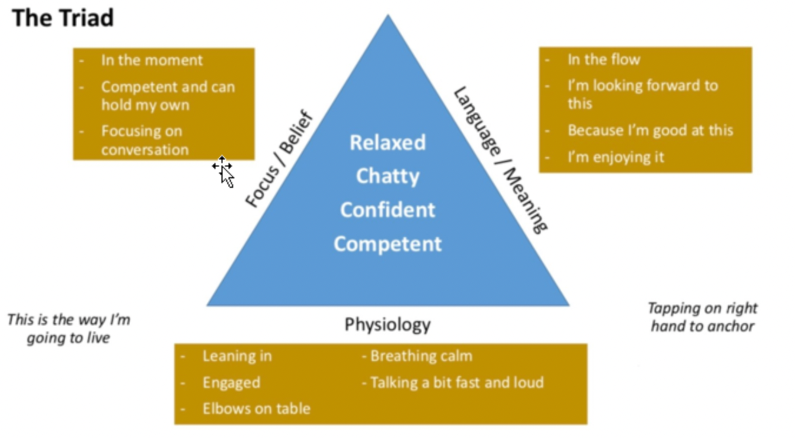

How do you get into alignment? How can self-awareness help you close the gap? Well, it all begins with you. Given the many factors at play in adaptability, and resilience, the most important is your internal dialogue; what you are telling yourself about each situation. Even SCARF social threat responses are subordinate to your inner voice. What you focus on creates the dialogue which triggers physiological responses, which in turn prompt more dialogue and actions. A situation initially might be neutral. What it becomes, often in seconds, is the reality that you create. You determine what your experience will be based on the TRIAD:

1. Physiology
2. Focus
3. Language

#### Physiology

Physiology refers to your body and all its systems, and by extension, elements that directly impact those systems. Physiology dictates your feelings. How you use your body affects how you feel mentally and emotionally. If you want to master your feelings, you must be aware of how your feelings and your body are interconnected. If you stand up straight, you feel more proud and alert. If you slump over and neglect your body, you're more likely to feel negatively. The next time you find yourself in a bad mood, stand up, breathe deeply, and put a smile on your face. You have the power to reset your mind and mood. This physiological concept also includes taking care of yourself. You know intuitively that you feel your best when you get enough sleep, when you nourish your body with quality foods and nutrients. Even though it can be tempting to skimp on these basic things, don't take that shortcut. Give yourself enough sleep to keep your mind clean and clear, and take the time to eat foods that make you feel full, nurtured, and healthy.

#### Focus

Where focus goes, energy flows.  What you put your focus on is where you set your intention. Focus on the things you want and are working towards instead of the things that are holding you back. Setting your focus on the positives is one of the most essential steps towards achieving adaptability and resilience. If you feel your focus wavering or needing a little refreshment, consider clearing your mind. Exercise can help you release stress and center your focus. If you don't have time to hit the gym or go for a run, consider doing a short meditation to refresh your focus. Meditate each morning. By the way, you can meditate anywhere, even at your desk at work. In addition to the obvious health benefits, you'll find it easier to direct your focus.

#### Language

You speak to yourself internally and out loud. How you talk to yourself determines how you operate in the world. If you ask questions like, why do bad things always happen to me instead of what can I do to better my situation? You are more likely to feel powerless in your own life. How you use language determines what emotions you feel, so choose wisely when you speak to yourself and to others. In order to keep yourself thinking positively and focused on the future and possibilities, keep track of your positive and negative words. Every time you find yourself saying a word that takes your focus in the negative direction, replace that word with a new positive one. If you're struggling to catch your own negative words, enlist the help of friends, family, and even co-workers. Once you begin to alter your spoken word patterns and funnel them into a more positive frame, you'll more easily be able to alter your internal speech to yourself. By changing your language you can change your focus and achieve more adaptability and resilience.

### The Eye of the Hurricane Meditation

Read Mindful Script (Eye of the Hurricane), it might even benefit you to have someone read this slowly aloud so you are able to close your eyes.

* Find a comfortable meditation position, either sitting on a cushion on the floor, or on a chair. Sit tall with your back straight, but shoulders relaxed. And let your hands rest in your lap, and gently close your eyes.
* Let’s take three deep, slow breaths to begin.
* Become aware of your body, sitting here. Notice the sense of contact between your body and the seat beneath you... notice your feet on the floor... notice your clothes against your skin.
* Now let’s consider a metaphor. Within the strong, turbulent winds of a hurricane, the eye, the center of the hurricane, is quiet. There is no wind and no movement there. For a moment, picture this idea in your mind. Can you visualize the strong, turbulent winds of a hurricane, and the inner core that is peaceful and quiet?
* Let’s see if you can become like the center of the hurricane. Your current circumstances, your thoughts, your feelings, and the sensations throughout your body, can be compared to the winds of a hurricane. Is it possible for you to let go of all of these things for a moment, so that you are no longer taking part in them... like the center of the hurricane is not taking part in the turbulent surrounding winds.
* To do this, start by focusing on your breath. Simply breathe in and breathe out. Focus inward.
* Just like the eye is deep within the hurricane, your eye is deep within you. Use your breath to connect to this part of you. Simply breathe in and breathe out.
* Stay connected to your breath. If anything stressful happens in this moment, such as negative thoughts, unpleasant feelings, annoying sounds, difficult life events, memories... try to look at them as if they are the turbulent wind of the hurricane; whirling around, continually changing, unpredictable in nature...
* Notice that you are not them. You are the silent center of the hurricane, the part that is peaceful, despite what is happening around you.
* You are the silent center of the hurricane, peaceful and at ease.
* You are not reacting, you are simply observing. Like the wind of the hurricane, these experiences are constantly moving and changing. You, on the other hand, are stable. You are not moving or being carried away by them.
* As you are breathing, notice how you move more and more towards the center of the hurricane, towards the eye. Just like the turbulent wind of the hurricane, your thoughts, your feelings and whatever is happening outside yourself is still going on, but you are no longer part of it. You are in a safe, peaceful place... Breathing in, breathing out.
* As you sit here, connected to your eye, notice whatever arises. Notice the wind of the hurricane, but do not participate. Stay in the eye. Notice thoughts... notice feelings... notice sensations... continue to watch the ever-changing nature of the world inside and outside you. Watch from a distance, with curiosity, and without judgment... without reacting to what you see.
* No matter how intense or bad the hurricane gets, the eye is always centered, calm and at ease. Even the most turbulent hurricane cannot hurt or harm the eye; the eye is safe. Whenever you feel you need to restore your inner peace, use your breath to connect to this silent part of yourself. Just breathe in and breathe out. It may help to visualize the hurricane, with yourself in the center.
* It can be difficult to see the eye of the hurricane at times, and sometimes we forget the eye is there... however, it is always there. If we examine closely enough—even the strongest, darkest hurricane— sooner or later we’ll see the eye, centered and constant.
* Now, when you feel ready, slowly open your eyes.

**Reflection**

* What was it like to connect to the observing self?
* How do you feel now?
* Did you resonate with the metaphor of the eye of the hurricane? If not, can you think of another metaphor that would resonate with you more?
* Sometimes during meditation, issues that have been suppressed for some time begin to rise to the surface. Where there things that you noticed that you may have repressed in the past? If so, what kind of experiences did you notice? What was it like to notice them? How did you deal with them?

### Steps to Achieving Self-Awareness

Consider these five steps to achieving self-awareness.

#### 1. take time to reflect on your life
* How have your life events and background shaped your beliefs, values, thoughts, and behaviors?
* Who has had the greatest impact on you, both positively and negatively?
* What experiences have brought you the most joy and fulfillment?
* How have you managed setbacks?

#### 2. seek feedback

 * From family, friends, and co-workers
 * Identify normal opportunities for getting feedback
   * Project Completion
   * Presentations
 * Consider formal feedback as a gift
 * Questions to ask:
   * What are my 3 key strengths?
   * What do I do well?
   * What can I improve?

#### 3. psychometric test

* Myers-Briggs
* Clifton Strengths
* DISC Theory Profile

#### 4. journaling

* Increases your insights into yourself in situations
* Allows you to articulate your feelings
* Allows you to celebrate your progress

#### 5. resiliency assessment

### Barriers to Self-Esteem

* Lack of mindfulness
* Cognitive bias
* Willingness to seek feedback
* Confirmation bias
* Remembering self vs. experiencing self

### Why Self-Awareness?

* Truly understand your thoughts and emotions
* Know your strengths and weaknessses
* Adapt your thoughts
* Manage your behaviors
* Identify triggers that threaten your resilience
* Greater self-awareness brings greater self-confidence

#### What am I like?

Self-awareness is having a competent and accurate answer to the question: **"What am I like?"**

Evidence shows that good self-knowledge is key when building resilience. Follow our five steps to improve your self-awareness and resilience. Use your self-knowledge to manage your reactions and behaviors. Look after your mind, body, and spirit and keep at it. **The quest for self-awareness is never ending.**

### Receiving Feedback

[Accessing your Current Feedback Skills](feedback_assessment.pdf)

* Listen carefully
* Try not to get defensive
* Check your perceptions -- paraphrase
* Ask questions for clarification; ask for examples, paraphrase again
* Evaluate the accuracy and potential value of what you heard
* Gather additional information from additional sources and/or observe your own behavior
* Do no overract but do modify behavior when appropriate

**Remember - feedback received is about past behavior, NOT current or future behavior.  Open minds offer the possibility of learning something valuable.**

### Journaling

[Journaling Tips](journaling.pdf)

Writing in a journal is an opportunity to pause at some point in the day to write
down what’s on your mind. If you’ve never kept a journal before, writing down
your thoughts and feelings may seem awkward at first; it just takes some time
and commitment to make journaling into a positive habit that can help provide
you with valuable feedback.